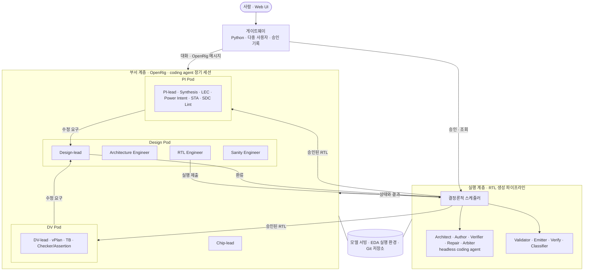
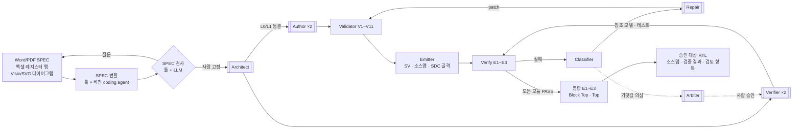
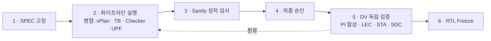

# ARCHITECTURE

Oct 8, 2026 · @Seungjoon Lee

Chip Design Department의 아키텍처 개요입니다. 시스템은 SPEC에서 RTL Freeze까지를 수행합니다.

이 문서는 두 설계 문서를 한곳에 모은 지도입니다. 세부 결정과 근거는 원문을 따릅니다.

- [Chip Design Department 설계](./docs/Chip%20Design%20Department%20설계.md): 부서 계층, Seat, 환류, 승인, 인프라, Web UI
- [LLM 기반 RTL 생성 파이프라인 설계](./docs/LLM%20기반%20RTL%20생성%20파이프라인%20설계.md): SPEC 규격, 파이프라인, IR 스키마, Validator, 검증, 이식 시험

---

## 1. 핵심 원칙

| 원칙 | 내용 |
| --- | --- |
| 두 계층 | 부서 계층(영속적 Seat)은 계획, 운영, 사람과의 대화, 독립 검증을 맡습니다. 실행 계층(파이프라인)은 결정론적 스케줄러와 단기 에이전트로 RTL을 생성하고 검증합니다. |
| IR이 유일한 소스 | RTL은 항상 IR에서 방출합니다. RTL을 IR로 되돌리는 역파싱은 없습니다. 손으로 고친 RTL은 다음 방출에서 사라지므로, 모든 수정은 파이프라인 입력으로 들어갑니다. |
| 구조는 툴, 동작은 LLM | 계층, 인터페이스, 상태 선언은 JSON입니다. 동작은 타입이 붙은 슬롯 안의 SV 조각입니다. 툴은 구조(포트, 리셋, 드라이버, 도메인)를 보장하고, 오류는 조각 하나로 국소화됩니다. |
| 결정론적 제어 흐름 | 순서, 분기, 반복 상한, 게이트는 스케줄러가 정합니다. 에이전트끼리는 메시지를 주고받지 않고 산출물로만 통신합니다. |
| 생성과 검증의 격리 | Author와 Verifier는 서로의 산출물을 보거나 고칠 수 없고, 서로 다른 계열의 로컬 모델을 씁니다. DV Pod는 파이프라인 테스트를 보지 않고 따로 검증합니다. |
| coding agent 기반 | LLM은 모두 coding agent 세션으로 씁니다. Seat는 OpenRig가 관리하는 장기 세션이고, 파이프라인 에이전트는 스케줄러가 작업마다 띄우는 headless 단기 세션입니다. 모델 API를 직접 호출하는 코드는 두지 않습니다. 기본 런타임은 Claude Code입니다. |
| 대화는 OpenRig로 | 사람의 대화는 Web UI → 게이트웨이 → OpenRig를 거쳐 각 Seat에 전달됩니다. |
| 단일 수정 창구 | 다른 Pod에서 나온 수정 요구는 Design-lead를 거쳐 네 가지 환류 형태 중 하나로만 들어갑니다. |
| 사람 승인 세 곳 | SPEC 고정, 최종 승인, RTL Freeze입니다. 실행 중의 게이트는 멈추지 않고 검토 항목으로 기록합니다. |
| 폐쇄망 | 파이프라인을 포함한 전체를 폐쇄망과 로컬 모델(비전 모델 포함)로만 실행합니다. |

## 2. 시스템 구성

| 계층 | 맡는 일 | 에이전트의 수명 | 제어 방식 |
| --- | --- | --- | --- |
| 사람 인터페이스 (Web UI) | 상태 열람, Seat와의 대화, lead에게 작업 지시, 승인 | — | 게이트웨이의 역할별 권한. 대화는 OpenRig를 거쳐 Seat에 전달 |
| 부서 계층 | 계획, 파이프라인 운영, 독립 검증, 구현 검증 | 영속적 Seat. 마일스톤 단위로 세션 초기화 | lead의 조율과 메시지 |
| 실행 계층 | SPEC에서 RTL을 생성하고 검증 | 모듈 단위의 단기 에이전트 | 결정론적 스케줄러 |
| 인프라 | 세션, 모델, EDA 툴, 저장소 | — | 폐쇄망 |

## 3. 부서 계층

총괄 1개와 Design, DV, PI 세 Pod로 이루어지며, Seat는 모두 15개입니다.

| Pod | Seat | 핵심 책임 |
| --- | --- | --- |
| 총괄 | Chip-lead | 마일스톤 계획, Block Top별 실행 순서, 최종 승인 자료 취합 |
| Design | Design-lead | 수정 요구의 단일 창구. 환류 분류 |
| | Architecture Engineer | SPEC 변환 결과 정리, 검사 질문의 답 초안. 정본은 사람이 확정 |
| | RTL Engineer | 파이프라인 실행 제출과 감시, 멈춘 모듈의 1차 분류. IR과 RTL을 직접 고치지 않음 |
| | Sanity Engineer | Lint(E3 결과를 넘겨받음), Superlint, Xprop, DFT, DCLint, IP-XACT, EPC |
| DV | DV-lead, vPlan, TB, Checker/Assertion | 파이프라인 Verifier와 독립된 검증. 고정된 SPEC과 L1만 입력으로 받음 |
| PI | PI-lead, Synthesis, LEC, Power Intent, STA, SDC Lint | 승인된 RTL의 구현 가능성 판정. UPF 작성 |

이름이 비슷한 두 역할을 구분합니다.

- **Architecture Engineer(Seat).** 실행 전에 SPEC을 다룹니다.
- **Architect(파이프라인 에이전트).** 실행 중에 Block Top 내부를 모듈로 분해합니다.

## 4. 실행 계층: RTL 생성 파이프라인

### 4.1 데이터 흐름

이중 괄호 상자가 LLM 에이전트이고, 나머지는 결정론적 툴입니다. LLM 에이전트는 모두 스케줄러가 작업마다 headless로 띄우는 coding agent 세션입니다. 작업 디렉터리에 과제 파일, 입력 산출물, 도구를 두고 실행하며, 종료 후 정해진 경로의 산출물을 회수합니다.

### 4.2 구성요소

| 구성요소 | 종류 | 입력 | 출력 |
| --- | --- | --- | --- |
| SPEC 변환 | 툴, 비전 coding agent | Word/PDF, 다이어그램 원본, 엑셀 | 10개 섹션 Markdown, WaveJSON, 경계 신호 목록 |
| SPEC 검사 | 툴, LLM | Markdown 초안 | 고정된 SPEC, 또는 작성자에게 돌려줄 질문 목록 |
| Architect | LLM | 고정된 SPEC, Block Top L1 | 모듈 트리, 하위 L1, `top`/`block_top` 연결, 가정 목록 |
| Author | LLM | SPEC 해당 부분, 동결된 L1 | 자기 모듈의 L2, L3 |
| Validator | 툴 | IR | 통과, 또는 노드가 지정된 오류 |
| Emitter | 툴 | 검증된 IR | SV 파일, 소스맵, SDC 골격 |
| Verifier | LLM | 고정된 SPEC, 동결된 L1 | Python 참조 모델, 시나리오, 속성 체커 |
| Verify | 툴 | SV, 테스트 | E1 Verilator lint, E2 Verilator sim, E3 VC SpyGlass |
| Classifier | 툴 | 실패 결과, 소스맵 | 실패 유형(11종), 대상 노드 |
| Repair | LLM | SPEC, IR, 실패 리포트, patch 이력 | `{op, target, field, value}` patch 목록 |
| Arbiter | LLM | SPEC, 불일치 트레이스, 양쪽 기댓값 | 테스트 수정안. 사람 승인 필요 |

### 4.3 실행 규칙

- **모듈 루프.** 트리 아래에서 위로 진행하고, 같은 레벨은 병렬로 실행합니다. 부모는 PASS한 실제 자식을 포함해 검증합니다.
- **중복과 선택.** Author 후보는 모든 Verifier의 테스트를 통과해야 합니다. 그중 Repair 횟수와 lint 경고가 적은 후보를 고릅니다.
- **차분 검사.** Verifier 간 차분은 SPEC의 모호함을 찾고 Arbiter로 보냅니다. Author 후보 간 차분은 테스트의 구멍을 찾고 Verifier로 보냅니다.
- **루프 제어.** 반복 상한과 예산 상한을 둡니다. IR 해시로 진동을 감지합니다. patch 뒤에는 항상 Validator부터 다시 실행합니다.
- **동결 해제.** 인터페이스 오류는 Architect로 올리고 영향 모듈만 다시 실행합니다. 같은 설계에서 두 번째 동결 해제가 필요해지면 실행을 중단합니다.
- **실행 중 멈춤.** 기댓값 변경이 생기거나 실패를 사람에게 넘겨야 하면 해당 모듈만 멈춥니다. 사람에게 넘기는 실패는 생성기 버그, 자식 모듈 원인 의심, 진동, 모든 후보 탈락입니다. 나머지 모듈은 계속 진행합니다.

### 4.4 에이전트 경계

| 에이전트 | 인스턴스 | 볼 수 있는 것 | 쓸 수 있는 것 |
| --- | --- | --- | --- |
| Architect | 설계당 1 | 고정된 SPEC, Block Top L1 | 모듈 트리, 하위 L1, 가정 목록 |
| Author | 모듈당 2 | SPEC 해당 부분, 동결된 L1 | 자기 후보의 L2, L3 |
| Verifier | Block Top당 2, 하위 모듈당 1 | 고정된 SPEC, 동결된 L1 | 참조 모델, 테스트 |
| Repair | 후보당 1 | SPEC, 자기 후보 IR, 실패 리포트, patch 이력 | patch (L2, L3, 연결만. 동결 범위, 테스트, waiver는 불가) |
| Arbiter | 불일치당 1 | SPEC, 트레이스, 양쪽 기댓값 | 수정 제안 |

쓰기 범위는 프롬프트가 아니라 patch 적용 툴, Validator V11(동결 해시 비교), 실행 전후의 작업 디렉터리 비교가 강제합니다.

## 5. IR

IR은 모듈당 JSON 파일 하나입니다. RTL의 유일한 소스이며, 다음 네 계층으로 이루어집니다.

| 계층 | 필드 | 내용 |
| --- | --- | --- |
| L0 | `instances`, `connections` | 인스턴스(파라미터 바인딩, `domain_map`)와 연결 |
| L1 | `params`, `domains`, `ports` | 파라미터, 클럭/리셋/전력 도메인, 포트 또는 프로토콜 번들 |
| L2 | `types`, `signals` | enum/struct 타입, `reg`/`wire` 신호 |
| L3 | `blocks` | `comb`, `seq`, `fsm`, `cdc_sync`, `memory` |

- **모듈 role.** `top`, `block_top`, `module`, `external`의 네 가지입니다. `top`과 `block_top`은 인스턴스, 연결, 동기화 셀만 가집니다. `external`은 L1만 가지며 등록된 RTL 파일을 그대로 참조합니다.
- **동결 범위.** 모든 모듈의 L1과 인스턴스 목록, `top`과 `block_top`의 연결과 동기화 셀입니다.
- **Validator.** V1 스키마부터 V11 동결까지 11단계로 검사합니다. 사용하는 수단은 JSON Schema, 심볼 테이블, pyslang AST, reads/writes 그래프입니다.
- **v1 제외.** generate, function/task, inout/tristate, 의도적 래치, 다중 비트 CDC, SVA는 아직 표현하지 못합니다.

## 6. 계층 간 인터페이스와 환류

부서 계층과 파이프라인은 아래 세 인터페이스로만 만납니다. RTL이나 IR을 직접 고치는 경로는 없습니다.

| 인터페이스 | 방향 | 내용 | 호출자 |
| --- | --- | --- | --- |
| 실행 제출 | 부서 → 파이프라인 | SPEC 버전과 설정(모델, 후보 개수, 예산)을 넘기고 실행 ID를 받음 | RTL Engineer |
| 상태와 결과 조회 | 파이프라인 → 부서 | 모듈별 상태, 검토 항목, 최종 보고서, 승인된 RTL | RTL Engineer, Chip-lead, 각 lead |
| 환류 | 부서 → 파이프라인 | 아래 네 형태의 수정 요구 | Design-lead |

| 환류 형태 | 발생원 | 파이프라인의 처리 |
| --- | --- | --- |
| 검사 실패 리포트 | Sanity, 합성, LEC | 소스맵으로 노드에 대응시킵니다. 조각 내부이면 Repair로, 골격이면 생성기 버그로 보냅니다. |
| SPEC 변경 요청 | DV 기능 버그, STA 구조 변경 | 사람 승인 뒤 SPEC을 개정하고 영향 모듈을 다시 실행합니다. DV 버그는 예시 시나리오로 추가합니다. |
| 생성기 버그 리포트 | Emitter 골격 코드의 위반 | Emitter 템플릿을 수정합니다. LLM으로 보내지 않습니다. |
| 설정 변경 | 모델, 후보 개수, 예산 | 다음 실행에 반영합니다. |

## 7. 진행 순서와 사람 승인

| 승인 지점 | 검토 대상 | 자료 준비 |
| --- | --- | --- |
| SPEC 고정 | 변환된 Markdown, WaveJSON과 원본의 대조, 검사 질문의 답 | Architecture Engineer |
| 최종 승인 | 검증 결과, 검토 항목 전체, 선택된 후보, 차분 검사 결과, Sanity 결과 | Chip-lead, RTL Engineer |
| RTL Freeze | DV의 검증 완료 판정, PI의 구현 가능성 판정 | Chip-lead, DV-lead, PI-lead |

같은 Block Top에서 환류에 따른 재실행이 3회 반복되거나 24시간 이상 진행이 없으면, 자동으로 멈추고 사람에게 알립니다.

## 8. 격리

OpenRig의 조율은 메시지와 규범에 기반하므로 접근을 막는 수단이 되지 못합니다. 그래서 격리는 OpenRig의 edge가 아니라 작업 디렉터리 권한, 저장소 권한, 파이프라인의 툴로 강제합니다.

| 규칙 | 강제 수단 |
| --- | --- |
| 수정 요구는 Design-lead만 제출 | 환류 인터페이스가 Design-lead의 제출만 받음 |
| DV Seat는 파이프라인 Verifier의 참조 모델과 테스트를 볼 수 없음 | 작업 디렉터리와 저장소 권한 분리 |
| 어떤 Seat도 IR과 방출된 RTL을 쓰지 못함 | 저장소 쓰기 권한은 파이프라인에만 부여 |
| 사람의 RTL 수정 지시는 SPEC 변경 요청으로 전환 | Seat의 기본 지침과 쓰기 권한 부재 |
| 파이프라인 에이전트는 Seat와 메시지를 주고받지 않음 | OpenRig에 등록하지 않는 headless 실행. 스케줄러가 입출력을 산출물로 제한 |
| Author ↔ Verifier, 후보끼리 서로의 산출물을 볼 수 없음 | 스케줄러의 입력 구성과 런타임 어댑터 |

## 9. 인프라와 배치

| 구성 | 역할 | 비고 |
| --- | --- | --- |
| OpenRig | Seat의 세션, 토폴로지(rig.yaml), 메시지와 큐 관리 | tmux 위에서 도는 단일 사용자 로컬 데몬. 스냅숏으로 복구 |
| 파이프라인 스케줄러 | 모듈 의존 그래프, 게이트, 자원 대기열, 상태 저장 | OpenRig의 서비스 묶음 방식으로 배치하고 RTL Engineer가 운영. Seat 세션과 상태를 분리 |
| coding agent 실행기 | 작업마다 격리된 작업 디렉터리에서 headless coding agent를 실행하고 산출물을 회수 | 런타임(Claude Code(기본), Pi, Codex, Antigravity(agy) 등)별 실행 명령 차이만 어댑터로 흡수. 도구는 CLI로 만들고 필요하면 MCP로도 노출 |
| 모델 서빙 | coding agent 런타임이 호출하는 언어 모델과 비전 모델 | 온프레미스 서빙과 호환 API 프록시. 런타임 외의 코드는 직접 호출하지 않음 |
| EDA 실행 환경 | Verilator, VC SpyGlass, DC, PowerPro/PowerArtist 등 | 표준 래퍼 스크립트만 호출. 라이선스 수에 맞춘 대기열 |
| 저장소 | SPEC, IR, RTL, 테스트, 리포트 | Seat별 Git worktree. 교환은 브랜치와 병합으로 수행 |
| 게이트웨이 + Web UI | 다중 사용자, 역할별 권한, 승인 기록, 환류 양식 강제, 대화 중계(OpenRig 데몬 API로 Seat에 전달) | Python 게이트웨이, React/TypeScript 프런트엔드. 인증은 자체 계정에서 사내 SSO로 교체 예정 |

Web UI는 승인 세 지점에 쓰이는 화면부터 만듭니다.

- **1차.** SPEC 작업대, 승인함, 실행 상세(읽기 전용)
- **2차.** 대시보드, 환류 관리, 리포트
- **3차.** 조직과 Seat, 설정

## 10. 추적성

- 모든 기능 요구사항에는 ID가 붙습니다. Verifier는 ID마다 검사를 하나 이상 대응시키고, 불일치 리포트와 Arbiter 판정은 이 ID를 인용합니다.
- 방출된 SV에는 `// @ir <id>` 주석과 소스맵이 붙습니다. 외부 툴의 파일과 줄 번호는 이것으로 IR 노드에 대응됩니다.
- 모든 환류와 승인은 실행 ID, 요구사항 ID, SPEC 버전과 함께 기록됩니다.

## 11. 미결 사항

**실험으로 확인할 것**

- [ ] coding agent 런타임이 로컬 모델로 동작하는지. OpenRig Seat와 headless 실행 둘 다. Seat 경로는 Pi 런타임의 Seat별 `models.json`
- [x] rig.yaml의 edge 종류. `handoff`와 `can_message`는 없고 `delegates_to`, `escalates_to`, `collaborates_with`, `can_observe`, `spawned_by`가 있음
- [ ] 폐쇄망 설치 절차. npm 사내 미러와 데몬의 외부 호출(플러그인 자동 갱신. 실패해도 동작함) 처리
- [ ] coding agent(로컬 모델)가 스키마에 맞는 IR 파일을 쓰고 검사 도구를 쓰는 비율
- [ ] 비전 모델을 쓰는 coding agent의 타이밍 다이어그램 변환 정확도
- [ ] 게이트웨이 → OpenRig → Seat 대화 왕복 (보낸 사람 구분, 동시 전송 포함)

**남은 질문**

- [ ] EPC 스위칭 활동 정보를 파이프라인 시뮬레이션 파형에서 가져올지
- [ ] 이식 시험 대상 블록 3개와 원시 블록 비중의 기준선
- [ ] Repair 반복 상한 값 (이식 시험 뒤 결정)

**받아야 할 자료**

- [ ] Word/PDF SPEC 양식, 엑셀 레지스터 맵, 블록 다이어그램 원본
- [ ] VC SpyGlass 사내 템플릿, 표준 동기화 셀, 메모리 매크로 래퍼 규약, 표준 프로토콜 태그, 사내 코딩 가이드
- [ ] 로컬 모델 목록과 계열, 폐쇄망에 반입할 coding agent 런타임, 외부 모듈의 RTL 위치

**첫 단계는 블록 이식 시험입니다.** LLM을 붙이기 전에 검증된 기존 블록 3개를 손으로 IR에 옮깁니다. 대상은 FSM 중심, datapath 중심, 다중 클럭 블록이며, 이를 통해 스키마의 표현력과 Emitter의 정확성을 확인합니다.
