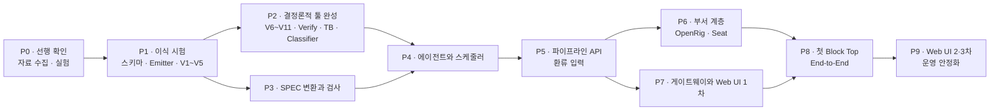

# IMPLEMENTATION

Oct 8, 2026 · @Seungjoon Lee

[ARCHITECTURE.md](./ARCHITECTURE.md)를 구현하는 순서와 단계별 완료 기준입니다.

계획은 두 가지 원칙을 따릅니다.

- **LLM 없이 먼저 검증합니다.** IR 스키마, Emitter, Validator, Verify를 LLM 없이 먼저 만들고, 기존 블록으로 검증합니다. 결정론적 툴이 틀리면 그 위에 올린 에이전트의 결과도 판정할 수 없기 때문입니다.
- **안쪽에서 바깥쪽으로 쌓습니다.** 실행 계층을 먼저 만들고, 그다음 부서 계층과 Web UI를 붙입니다. 각 단계는 앞 단계의 산출물만으로 시험할 수 있어야 합니다.

일정은 인원과 자료 입수 시점에 달려 있어서 적지 않았습니다. 순서와 완료 기준만 정합니다.

---

## 0. 전제와 가정

| 항목 | 가정 | 근거 |
| --- | --- | --- |
| 파이프라인 구현 언어 | Python | pyslang, cocotb, 게이트웨이가 모두 Python입니다. **설계 문서에서 확정된 사항은 아닙니다.** |
| IR 스키마 | JSON Schema (draft 2020-12) | V1 단계의 수단 |
| SV 파싱 | pyslang | V3, V4 단계의 수단 |
| 시뮬레이션 | Verilator + cocotb | E1, E2 단계의 수단 |
| 최종 lint | VC SpyGlass 사내 템플릿을 래퍼로 호출 | E3 단계의 수단 |
| 프런트엔드 | React + TypeScript | 확정 사항 |
| 저장소 | Git. Seat별 worktree | 확정 사항 |
| LLM 실행 | coding agent(Claude Code(기본), Pi, Codex, Antigravity(agy) 등). Seat는 OpenRig 장기 세션, 파이프라인 에이전트는 스케줄러가 띄우는 headless 세션. 모델 API를 직접 호출하는 코드는 없음 | 확정 사항 |
| 사람과 Seat의 대화 | Web UI → 게이트웨이 → OpenRig 데몬 → Seat | 확정 사항 |

## 1. 저장소 구조 (제안)

```
chip-design-depart/
├── ARCHITECTURE.md
├── IMPLEMENTATION.md
├── docs/                       # 상세 설계 문서 (Chip Design Department, RTL 생성 파이프라인)
├── examples/i3c_basic_controller/ # 공개 예시 SPEC (I3C Basic v1.2 controller, 10개 섹션)
├── experiments/p0/             # P0 실험 키트 (X1~X6 안내서, 실행 스크립트)
├── schema/                     # IR JSON Schema (L0~L3), patch 스키마, 환류 양식 스키마
├── pipeline/
│   ├── ir/                     # IR 로더, 심볼 테이블, reads/writes 그래프
│   ├── validator/              # V1~V11
│   ├── emitter/                # SV 템플릿, 소스맵, SDC 골격
│   ├── verify/                 # E1~E3 래퍼, 리포트 파서
│   ├── tb/                     # cocotb 하니스 생성기, 프로토콜 체커 라이브러리
│   ├── classifier/             # 실패 분류 11종, 외부 리포트 입력
│   ├── patch/                  # patch 적용 툴, 쓰기 범위 강제
│   ├── spec/                   # Word/PDF/엑셀/다이어그램 변환, SPEC 검사
│   ├── agents/                 # coding agent 실행기(런타임별 실행 명령), 역할별 TASK 템플릿과 도구 집합
│   ├── scheduler/              # 의존 그래프, 게이트, 대기열, 상태 저장
│   └── api/                    # 실행 제출, 상태 조회, 환류 (CLI + HTTP)
├── tools/                      # MCP 도구 서버 (Validator 사전 실행, 트레이스 조회 등)
├── eda/                        # EDA 표준 래퍼 스크립트
├── rig/                        # rig.yaml, Seat 기본 지침
├── gateway/                    # Python 게이트웨이
├── web/                        # React + TypeScript
└── tests/
    ├── fixtures/               # 설계 문서의 IR 예시 (pkt_parser, pkt_rx_top)
    ├── golden/                 # 이식 시험 블록의 IR, 기대 RTL
    └── ...
```

## 2. 단계 개요



P2와 P3은 병렬로 진행할 수 있고, P6과 P7도 병렬로 진행할 수 있습니다.

---

## P0. 선행 확인

설계의 전제가 실제 환경에서 성립하는지 확인합니다. 결과에 따라 이후 단계의 선택지가 바뀝니다.

실행 절차, 통과 기준, 스크립트는 [experiments/p0/README.md](./experiments/p0/README.md)에 있습니다.

### 실험

| # | 실험 | 실패할 때의 대안 | 영향을 받는 단계 |
| --- | --- | --- | --- |
| X1 | coding agent(로컬 모델)가 스키마에 맞는 IR 파일을 쓰고 검사 도구를 쓰는 비율 (런타임과 모델 조합별) | 다른 조합으로 교체하거나 출력 단위를 작게 쪼갬 | P4 |
| X2 | 비전 모델을 쓰는 coding agent의 타이밍 다이어그램 → WaveJSON 정확도 | 사람이 WaveJSON을 작성하고 coding agent는 초안만 만듦 | P3 |
| X3 | coding agent 런타임이 로컬 모델로 동작하는지. OpenRig Seat(Pi 런타임의 Seat별 `models.json`)와 headless 실행 둘 다 | `terminal` 런타임에 다른 coding agent를 올림 | P4, P6 |
| X4 | rig.yaml edge 종류. **완료:** `handoff`, `can_message`는 없음. 있는 다섯 가지로 대응 관계를 정함 | 해당 없음 (격리는 원래 권한으로 강제함) | P6 |
| X5 | 폐쇄망 설치. npm 사내 미러, 데몬의 외부 호출(플러그인 자동 갱신 1건 확인. 실패해도 동작), coding agent 런타임의 외부 호출 | 설정이나 패치로 호출을 끔 | P6 |
| X6 | 게이트웨이 → OpenRig 데몬 API → Seat 대화 왕복. 보낸 사람 구분, 동시 전송, 응답을 메시지 단위로 읽기 | Seat가 정해진 형식의 응답 파일이나 큐 항목을 남기는 규약 | P7, P9 |

### 수집할 자료

- Word/PDF SPEC 양식과 예시, 엑셀 레지스터 맵, 블록 다이어그램 원본(Visio/SVG)
- VC SpyGlass 사내 템플릿의 호출 방식과 리포트 형식
- 표준 동기화 셀, 메모리 매크로 래퍼 규약, 표준 프로토콜 태그 목록, 사내 코딩 가이드
- 로컬 모델 목록(언어, 비전)과 계열
- 이식 시험 대상 블록 3개와 그 테스트벤치: FSM 중심, datapath 중심, 다중 클럭. 이 중 하나는 계층 모듈이어야 합니다.

### 완료 기준

- X1\~X6의 결과가 기록되어 있고, 실패한 항목은 대안이 정해져 있습니다.
- 이식 시험 블록 3개와 사내 템플릿을 받았습니다.

---

## P1. 블록 이식 시험

LLM 없이 스키마의 표현력과 Emitter의 정확성을 확인합니다. 설계 문서의 절차 2\~7을 이 단계에서 수행합니다. 절차 1(SPEC 변환)은 P3에서 수행합니다.

### 작업

1. **스키마.** `schema/`에 L0\~L3의 JSON Schema를 작성합니다. 모듈 role 4종과 블록 종류 5종을 포함합니다. v0 초안은 `schema/ir.schema.json`에 있습니다.
2. **IR 코어.** `pipeline/ir/`에 로더, 이름 기반 심볼 테이블, reads/writes 그래프를 만듭니다.
3. **Validator V1\~V5.** 스키마, 참조, 표현식(pyslang), 조각, 드라이버 단계입니다. 모든 오류에 노드 이름이나 `id`를 붙입니다.
4. **최소 Emitter.** 블록 종류 5종의 방출, `domain_map` 기반 클럭과 리셋 배선, `// @ir <id>` 주석, 소스맵을 만듭니다.
5. **손 이식.** 블록 3개를 손으로 IR에 옮기고 `tests/golden/`에 둡니다. 막힌 지점은 기록 항목 표에 따라 남깁니다.
6. **판정.** 방출된 RTL이 기존 테스트벤치와 VC SpyGlass 사내 템플릿을 통과하는지 봅니다.

### 완료 기준

- 블록 3개의 방출 RTL이 기존 테스트벤치를 통과합니다.
- 골격 코드에서 SpyGlass 위반이 0건입니다. 남은 위반이 있으면 Emitter 템플릿을 고칩니다.
- 기록 항목(표현 불가 구문, 우회 표현, 원시 블록 비중, Validator 오탐)을 정리하고, 판정 규칙에 따라 스키마 조정안을 확정했습니다.
- 원시 블록 비중의 기준선과 Repair 반복 상한의 초기값을 정했습니다.

> **분기점.** 원시 블록 비중이 대부분이면 JSON 계층을 얇게 줄이는 방향으로 ARCHITECTURE.md를 개정한 뒤 P2로 넘어갑니다.

---

## P2. 결정론적 툴 완성

파이프라인에서 LLM이 아닌 부분을 모두 완성합니다.

| 영역 | 작업 | 완료 기준 |
| --- | --- | --- |
| Validator | V6 래치와 루프, V7 리셋, V8 도메인, V9 FSM, V10 계층, V11 동결 해시 | 규칙마다 통과 사례와 실패 사례의 단위 테스트가 있고, golden IR 3개는 오탐 없이 통과 |
| Emitter | SDC 골격(클럭 정의, 비동기 클럭 그룹, CDC 경로), `external` 참조, 전력 도메인 L1 기록, `memory` 매크로 래퍼 | Emitter 대표 출력물의 SpyGlass 통과를 회귀 테스트로 CI에 등록 |
| Verify | E1 Verilator lint, E2 Verilator sim, E3 SpyGlass 래퍼와 리포트 파서. 라이선스 대기열 | 세 단계 결과가 같은 형식(툴, 규칙, 파일, 줄, 메시지)으로 나옴 |
| 테스트벤치 | L1에서 cocotb 하니스 생성. 번들 프로토콜별 드라이버, 모니터, 스코어보드 골격. 프로토콜 체커 라이브러리 | golden 블록에 생성된 하니스를 붙이고 손으로 쓴 참조 모델로 T1\~T5 실행 |
| Classifier | 실패 유형 11종. 소스맵으로 조각 내부와 골격 구분. 외부 리포트 입력 경로 | 유형마다 재현 사례가 있음 |
| patch 툴 | `{op, target, field, value}` 적용. 쓰기 범위와 동결 범위를 강제하고 waiver 추가를 거부 | 범위를 벗어난 patch가 거부되는 테스트 |
| 불일치 리포트 | 첫 불일치 트랜잭션, FSM 트레이스, 팬인 신호 값, SPEC 구절 묶음 | golden 블록에 버그를 일부러 넣었을 때 리포트가 원인 노드를 포함 |

VC SpyGlass에서 반복해서 걸리는 규칙은 Validator 규칙으로 옮깁니다.

---

## P3. SPEC 변환과 검사

P1과 독립적으로 진행할 수 있습니다. 다만 템플릿 섹션의 대응은 P0에서 받은 Word 양식이 있어야 확정됩니다.

| 작업 | 내용 | 완료 기준 |
| --- | --- | --- |
| Word 변환 | 10개 섹션 템플릿으로 결정론적 변환 | 양식 목차와 10개 섹션의 대응표 확정 |
| PDF 변환 | 배치 기반으로 표와 제목 추정, 스캔본은 OCR | 결과 전체를 사람이 검토하는 흐름이 있음 |
| 엑셀 레지스터 맵 | 직접 파싱. IP-XACT, 문서 내 표와 대조해 경고 | column 정의 확정 |
| 블록 다이어그램 | Visio 연결 관계, SVG 좌표 추정, PDF 벡터 추출. 실패하면 작성자에게 반려 | Block Top 표시 규칙 확정. 경계 신호와 인터페이스 표의 교차 검사 |
| 타이밍 다이어그램 | 비전 모델을 쓰는 coding agent로 WaveJSON 변환, 다시 렌더링, 태그와 설명 파싱, 원본 해시 캐시 | X2 결과를 반영 |
| Block Top L1 생성 | SPEC 2\~4번 섹션의 표에서 L1 생성 (전력 도메인 포함) | 생성된 L1이 Validator V1\~V3 통과 |
| SPEC 검사 | 툴 검사(필수 섹션, 포트 참조 등), LLM 검사(모호함, 모순, 빠진 코너 케이스) | 미해결 질문이 검토 항목으로 기록됨 |

**첫 입력.** 이식 시험 블록 3개의 SPEC을 변환하고 고정합니다. 이 3개가 P4에서 정답이 있는 첫 입력이 됩니다.

**공개 예시 SPEC.** MIPI I3C Basic v1.2의 controller를 예시로 씁니다. 사내 양식이 아닌 공개 PDF라서 PDF 변환 경로와 SPEC 검사 게이트를 시험하기에 좋고, 결과를 공개 저장소에서 다룰 수 있습니다. SPEC 원본은 `experiments/specs/`에 두고 저장소에는 올리지 않습니다. 10개 섹션으로 정리한 초안은 [examples/i3c_basic_controller](./examples/i3c_basic_controller/)에 있습니다. 기존 RTL과 테스트벤치가 없으므로 P1 이식 시험 대상으로는 쓰지 않습니다.

---

## P4. 에이전트와 스케줄러

결정론적 툴 위에 LLM 에이전트를 올립니다.

### 순서

1. **coding agent 실행기.** 작업마다 격리된 작업 디렉터리를 만들고, 과제 파일(`TASK.md`), 입력 산출물, 도구를 둔 뒤 headless coding agent를 실행합니다. 종료 후 출력 산출물을 회수하고, 실행 전후를 비교해 쓰기 범위 밖 변경을 거부합니다. 런타임(Claude Code(기본), Pi, Codex, Antigravity(agy) 등)별 실행 명령 차이만 어댑터로 흡수하고, 역할마다 런타임과 모델을 설정으로 바꿀 수 있게 합니다. P0 X1 키트의 `experiments/p0/common/agent.py`가 출발점입니다.
2. **도구.** Validator 사전 실행, patch 사전 실행, 팬인 조회, 트레이스 조회, SPEC 구절 조회, 하니스 생성, 모델 단독 실행입니다. 작업 디렉터리에서 실행하는 CLI로 만들고, 필요하면 MCP 서버로도 노출합니다.
3. **에이전트 하나씩 붙이기.** 매번 golden 블록으로 평가합니다.

| 순서 | 에이전트 | 단독 평가 방법 |
| --- | --- | --- |
| 1 | Author | golden L1을 고정한 채 L2, L3 생성. 기존 테스트벤치로 판정 |
| 2 | Repair | golden IR에 버그를 주입하고 실패 리포트로 수정. 범위 위반 0건 |
| 3 | Verifier | golden RTL(정답)에 대해 참조 모델과 테스트 통과. 버그 주입 RTL은 검출 |
| 4 | Architect | golden 모듈 트리와 비교. 가정 목록 출력 |
| 5 | Arbiter | 기댓값을 일부러 틀린 테스트를 SPEC 근거로 판정 |

4. **스케줄러.** 모듈 의존 그래프를 아래에서 위로, 같은 레벨은 병렬로 실행합니다. 주요 기능은 다음과 같습니다.
   - 후보 중복(Author 2, Verifier 2)과 모델 계열 중복 경고
   - 차분 검사 두 종류와 후보 선택 규칙
   - 반복 상한, 예산 상한, IR 해시 기반 진동 감지
   - 동결 해제의 전파(진행 중인 루프 취소)와 두 번째 동결 해제 시 중단
   - 기댓값 변경 승인 대기(해당 모듈만), 사람에게 넘기는 실패
   - 검토 항목 기록(5개 조건), 모듈별 상태 저장과 재개
   - 종료 게이트: Validator를 통과한 산출물만 받음
5. **통합 단계.** `block_top`과 `top`에 대해 E1\~E3을 실행하고 최종 보고서를 만듭니다.

### 완료 기준

- 이식 시험 블록 3개를 SPEC부터 끝까지 사람 개입 없이 실행합니다. 결과 RTL은 기존 테스트벤치를 통과합니다.
- 실행을 강제로 중단한 뒤 같은 상태에서 재개됩니다.
- 격리를 시험합니다. Verifier의 입력에 L2, L3, RTL이 없고, Author 후보끼리 서로의 산출물이 보이지 않습니다.

---

## P5. 파이프라인 API와 환류 입력

부서 계층이 호출할 세 인터페이스를 CLI와 HTTP로 노출합니다.

| 인터페이스 | 엔드포인트 (예시) | 비고 |
| --- | --- | --- |
| 실행 제출 | `POST /runs` → `run_id` | SPEC 버전, 모델, 후보 개수, 예산 |
| 상태와 결과 조회 | `GET /runs/{id}`, `/runs/{id}/modules`, `/runs/{id}/review-items`, `/runs/{id}/report` | 승인된 RTL은 읽기 전용 브랜치로 제공 |
| 환류 | `POST /runs/{id}/feedback` | 형태 4종 스키마 검증. 제출자는 Design-lead만 허용 |

- **검사 실패 리포트 입력.** Superlint, Xprop, DFT, DCLint, 합성, LEC 리포트의 파서입니다. 파서는 툴, 규칙, 파일, 줄, 메시지로 정규화한 뒤 Classifier로 넘깁니다.
- **영향 모듈만 재실행.** SPEC 변경 요청이 들어오면 바뀐 요구사항 ID에서 영향 모듈을 계산합니다.
- **교착 방지.** 같은 Block Top에서 재실행이 3회 반복되거나 24시간 이상 진행이 없으면 자동으로 멈추고 알립니다.
- **이력.** 모든 환류를 실행 ID, 요구사항 ID와 함께 기록합니다.

**완료 기준.** 외부 리포트 샘플을 넣으면 조각 내부 위반은 Repair로, 골격 위반은 생성기 버그로 분류됩니다.

---

## P6. 부서 계층 (OpenRig)

P0의 X3\~X6 결과를 전제로 진행합니다.

| 작업 | 내용 |
| --- | --- |
| 폐쇄망 설치 | 사내 미러, 외부 호출 차단, 설치 절차 문서화 |
| rig.yaml | 4개 Pod, 15개 Seat, edge, 연속성 정책 |
| Seat 기본 지침 | 역할별 지침. 공통 규칙은 RTL/IR을 직접 수정하지 않고 수정 요구는 환류 양식으로만 내는 것 |
| 권한 분리 | Seat별 Git worktree. IR과 RTL 쓰기 권한은 파이프라인 계정에만 줌. DV Seat는 Verifier 산출물 경로에 접근 불가 |
| 스케줄러 배치 | OpenRig 서비스 묶음으로 배치. Seat 세션 초기화와 실행 상태 분리 |
| Seat 도구 | 파이프라인 API 클라이언트. 환류 제출은 Design-lead에게만 노출 |
| Sanity 연동 | E3 결과를 넘겨받음. DCLint는 SDC 골격과 UPF를 입력으로 받음. EPC 래퍼 |
| 복구 | OpenRig 스냅숏으로 토폴로지 복구 절차 |

**완료 기준.**
- 권한 위반 시도가 실패합니다. 예를 들어 DV Seat가 Verifier 테스트를 읽거나, Seat가 RTL에 쓰려 하면 거부됩니다.
- Seat 세션을 초기화해도 진행 중인 실행에 영향이 없습니다.

---

## P7. 게이트웨이와 Web UI 1차

P6과 병렬로 진행합니다. 게이트웨이는 파이프라인 API와 OpenRig 데몬 앞에 둡니다.

| 작업 | 내용 |
| --- | --- |
| 게이트웨이 | 자체 계정 인증. 인증 모듈은 SSO로 교체할 수 있게 분리. 5개 역할(관리자, 설계, 검증, 구현, 승인자)의 권한. 승인 기록(누가, 언제, SPEC 버전, 실행 ID). OpenRig 데몬 API 연결(Seat 상태 조회, 이후 대화 중계의 기반). 모델은 직접 호출하지 않음 |
| SPEC 작업대 | 원본과 변환 결과의 나란한 대조, 원본 파형과 WaveJSON 렌더링의 대조, 검사 질문에 답하기 |
| 승인함 | SPEC 고정, 최종 승인, RTL Freeze, 기댓값 변경의 승인과 반려 |
| 실행 상세 (읽기 전용) | 모듈 트리와 상태, 후보별 진행, 검토 항목, 실패 분류, RTL과 IR 노드의 대응(소스맵), 에이전트 작업별 출력과 transcript |
| 환류 양식 | 형태, 대상, 근거를 받는 양식. 자유 텍스트로 수정을 요청하는 경로는 두지 않음 |

**완료 기준.** 승인자 역할만 승인할 수 있고, 모든 승인이 기록에 남습니다.

---

## P8. 첫 Block Top End-to-End

이식 시험 블록이 아닌 실제 신규 Block Top 하나로 진행 순서 1\~6을 모두 거칩니다.

1. SPEC 작업대에서 SPEC을 고정합니다.
2. RTL Engineer가 실행을 제출합니다. 같은 시점에 DV Pod가 검증 환경을, PI Pod의 Power Intent Seat가 UPF를 준비합니다.
3. Sanity 검사를 실행합니다.
4. 승인함에서 최종 승인합니다.
5. DV가 독립 검증을, PI가 합성, LEC, STA, SDC 검사를 진행합니다. 환류가 생기면 2단계로 돌아갑니다.
6. RTL Freeze를 검토합니다.

**완료 기준.**
- RTL Freeze에 도달합니다.
- 모든 환류가 4가지 형태로 분류되어 기록되어 있습니다.
- 회고에서 검토 항목 조건, 반복 상한, 예산의 조정안을 냅니다.

---

## P9. 운영 안정화

- **Web UI 2차.** 대시보드, 환류 관리, 리포트
- **Web UI 3차.** 조직과 Seat(Seat 상태, 대화, lead에게 작업 지시. 지시 입력은 lead에게만 노출. 대화는 게이트웨이가 OpenRig 데몬 API로 Seat에 전달하고 transcript로 응답을 보여 줌. X6 결과를 따름), 설정(역할별 모델, 후보 개수, 예산, 라이선스 대기열)
- **SSO 연동**
- **v1 제외 항목 확장.** 이식 시험과 P8에서 실제로 필요하다고 드러난 것만 추가합니다. 후보는 generate, function/task, inout, 다중 비트 CDC, SVA입니다.
- **EPC 스위칭 활동 정보.** 출처를 정하고 연동합니다.

---

## 3. 횡단 관심사

| 항목 | 방침 |
| --- | --- |
| 테스트 | golden 블록 3개의 IR → RTL → 기존 TB 통과를 CI 회귀로 둡니다. Emitter 대표 출력의 SpyGlass 통과도 CI에 넣습니다. |
| 재현성 | 실행마다 SPEC 버전, 모델 설정, 시드, 툴 버전을 기록합니다. 에이전트 입출력 산출물은 모두 저장합니다. |
| 관측 | 모듈별 상태 전이, 반복 횟수, 토큰과 시간 사용량, 라이선스 대기 시간을 기록합니다. headless 에이전트의 출력, transcript, 작업 디렉터리를 실행 ID별로 보관합니다. |
| 추적성 | 요구사항 ID에서 검사, 불일치 리포트, 환류, 승인까지 연결합니다. |
| 보안과 격리 | 격리는 지침이 아니라 파일시스템, 저장소 권한, 스케줄러 입력 구성으로 강제하고, 이를 테스트로 확인합니다. |

## 4. 위험과 대응

| 위험 | 신호 | 대응 |
| --- | --- | --- |
| coding agent의 구조화 출력 품질 부족 | X1에서 통과율이 낮음 | 런타임과 모델 조합 교체, 출력 단위 축소, 재시도 정책 |
| 스키마 표현력 부족 | P1에서 원시 블록 비중이 높거나 우회 표현이 많음 | 판정 규칙에 따라 스키마 조정 또는 SV 소스 중심으로 전환 |
| 테스트 약화 방향으로 수렴 | Author 후보 간 차분이 자주 발생, 커버리지 정체 | Verifier 격리를 확인하고 테스트 보강 루프와 사람 검토를 강화 |
| 공통 오독 | DV에서 기능 버그 발견 | 예시 시나리오 보강, 참조 모델의 사람 검토 비중 확대 |
| OpenRig 폐쇄망 비호환 | X3, X5, X6 실패 | 자체 Seat 런타임으로 대체. 부서 계층의 설계 원칙은 그대로 유지 |
| EDA 라이선스 병목 | E3 대기 시간 증가 | 후보 선택 뒤에만 E3 실행(설계 사항). 대기열 우선순위 조정 |
| 자료 입수 지연 | P0 자료 미수령 | P1은 기존 블록 RTL과 TB만으로 시작하고, SPEC 변환은 P3로 미룸 |
