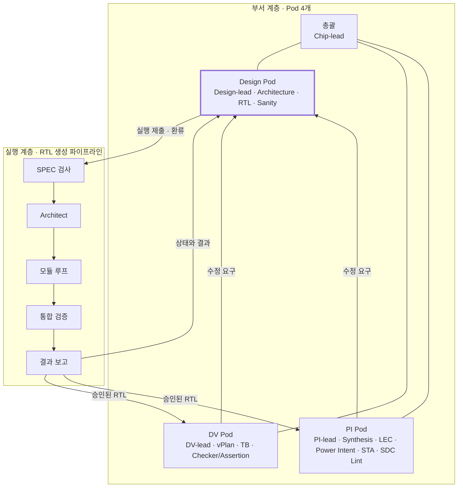
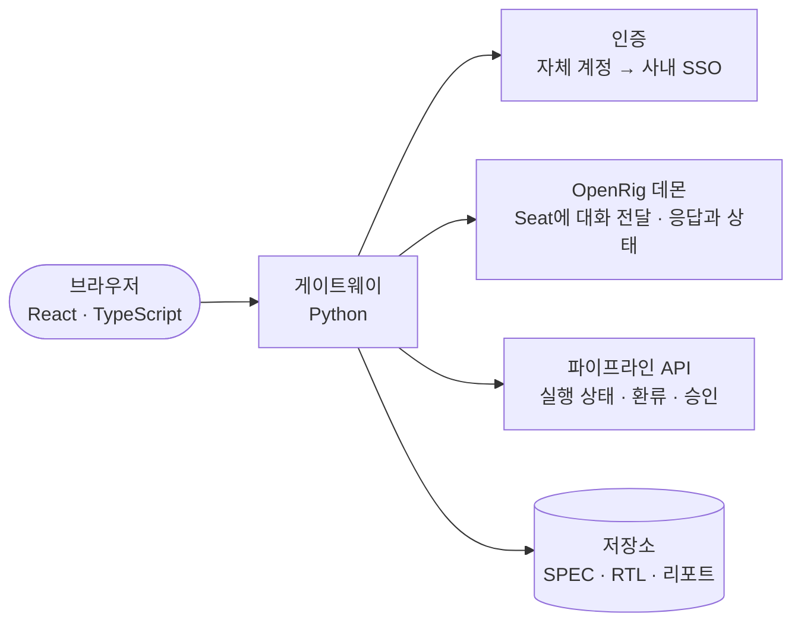

# Chip Design Department 설계

Oct 7, 2026 · @Seungjoon Lee

관련 문서: [ARCHITECTURE](../ARCHITECTURE.md) · [IMPLEMENTATION](../IMPLEMENTATION.md)

## 개요

이 시스템은 OpenRig 기반의 부서 계층(4개 Pod, 15개 Seat)이 RTL 생성 파이프라인을 운영하고, 그 결과를 독립 검증과 구현 검증으로 넘겨 SPEC에서 RTL Freeze까지를 수행합니다.

운영 범위, 역할, SPEC 양식에 대한 결정은 확정되었고, 실험과 자료로 확인할 항목만 다음 섹션에 남아 있습니다.

- **두 계층.** 부서 계층은 장기 운영, 사람과의 대화, 마일스톤을 맡습니다. 실행 계층인 파이프라인은 결정론적 스케줄러와 격리된 단기 에이전트로 RTL을 생성하고 검증합니다.
- **LLM은 coding agent로만.** Seat는 OpenRig가 관리하는 coding agent 장기 세션이고, 파이프라인 에이전트는 스케줄러가 띄우는 headless 세션입니다. 사람과 Seat의 대화는 OpenRig를 거칩니다.
- **Seat는 RTL을 직접 고치지 않음.** IR이 RTL의 유일한 소스라서, 손으로 고친 RTL은 다음 방출에서 사라집니다. 모든 수정은 파이프라인 입력으로 들어갑니다.
- **수정 요구의 단일 창구.** 다른 Pod에서 나온 수정 요구는 Design-lead를 거쳐 네 가지 형태 중 하나로 파이프라인에 들어갑니다.
- **독립된 판정 세 개.** 파이프라인 안의 Verifier 2개에 더해, DV Pod가 파이프라인의 테스트를 보지 않고 따로 검증합니다.
- **사람의 개입 지점.** SPEC 고정, 파이프라인 결과의 최종 승인, RTL Freeze 세 곳입니다.

## 확정된 결정과 남은 확인 사항

운영 범위, 역할, SPEC 양식, Web UI, LLM 실행 방식에 대한 16개 항목이 확정되었고, 실험과 자료로 확인할 8개 항목이 남아 있습니다.

### 확정된 결정

| 항목 | 결정 |
| --- | --- |
| EPC | Early Power Check. PowerPro와 PowerArtist를 함께 수행하는 방법론 |
| DCLint | Design Compiler에서 compile 직전까지 수행. analyze, elaborate, SDC와 UPF 읽기 |
| 운영 환경 | 파이프라인을 포함한 전체를 폐쇄망과 로컬 모델로만 실행. 비전 모델 포함 |
| 외부 모듈 | 직접 작성한 블록과 기존 IP를 L1만 가진 외부 모듈로 허용 |
| Architecture Engineer | SPEC 작성의 보조. 정본은 사람이 확정 |
| DV Pod | 파이프라인 뒤의 독립 검증 |
| RTL Engineer | 파이프라인 운영만 담당 |
| Sanity 시점 | 사람의 최종 승인 전에 실행. Lint는 파이프라인의 E3 결과를 넘겨받음 |
| 전력 도메인 | SPEC 2번 섹션에 전력 도메인, isolation, retention 요구를 추가 |
| SDC 골격 | Emitter가 클럭 정의, 비동기 클럭 그룹, CDC 경로 제약을 방출 |
| 사람 인터페이스 | 직접 구축하는 Web UI. 1차로 SPEC 작업대, 승인함, 실행 상세를 만듦 |
| LLM 실행 방식 | 모두 coding agent. 기본 런타임은 Claude Code. Seat는 OpenRig가 관리하는 장기 세션(`runtime: claude-code`), 파이프라인 에이전트는 스케줄러가 띄우는 headless 단기 세션. 로컬 모델은 Anthropic Messages API 호환 엔드포인트로 연결. 모델 API를 직접 호출하는 코드는 두지 않음 |
| Seat와의 대화 | Web UI → 게이트웨이 → OpenRig를 거쳐 Seat에 전달. 질문과 진행 확인은 모든 Seat와 자유. 작업 지시는 Chip-lead와 각 lead에게만. 수정 요구는 환류 양식으로만 제출 |
| 인증 | 사내 SSO 기반. 구현은 차후 |
| Verifier 테스트 열람 | 사람은 열람 가능. DV Seat는 불가 |
| Web UI 기술 스택 | 프런트엔드는 React와 TypeScript, 게이트웨이는 Python |

### 실험으로 확인할 것

- [ ] coding agent 런타임이 로컬 모델로 동작하는지. OpenRig Seat(장기 세션)와 headless 실행(파이프라인용) 둘 다
- [x] rig.yaml의 edge 종류. `handoff`와 `can_message`는 없고, `delegates_to`, `escalates_to`, `collaborates_with`, `can_observe`, `spawned_by`의 다섯 가지가 있음 (OpenRig 0.6.6 소스 확인)
- [ ] 폐쇄망 설치 절차. npm 사내 미러와 데몬의 외부 호출 처리. 소스에서 확인한 외부 호출은 플러그인 자동 갱신 1건이며 실패해도 동작함
- [ ] coding agent(로컬 모델)가 스키마에 맞는 IR 파일을 쓰고 검사 도구를 쓰는 비율
- [ ] 비전 모델을 쓰는 coding agent의 타이밍 다이어그램 변환 정확도
- [ ] 게이트웨이가 OpenRig를 통해 Seat에 메시지를 보내고 응답을 받는 왕복 (보낸 사람 구분, 동시 전송 포함)

### 남은 질문

- [ ] EPC에 쓸 스위칭 활동 정보를 파이프라인의 시뮬레이션 파형에서 가져올지

### 받아야 할 자료

- [ ] Word와 PDF SPEC 양식, 엑셀 레지스터 맵, 블록 다이어그램 원본(Visio 또는 SVG)
- [ ] 이식 시험 대상 블록 3개

## 전체 구조

부서 계층의 Seat는 파이프라인을 실행하고 결과를 받아 검증하며, 수정 요구는 Design Pod 한 곳을 거쳐 다시 파이프라인으로 들어갑니다.

강조된 Design Pod가 파이프라인의 유일한 진입점입니다. RTL Engineer가 실행을 제출하고, DV Pod와 PI Pod의 수정 요구는 Design-lead가 받아 환류합니다. 승인된 RTL은 DV Pod와 PI Pod로 넘어갑니다.

| 계층 | 맡는 일 | 에이전트의 수명 | 제어 방식 |
| --- | --- | --- | --- |
| 부서 계층 | 계획, 파이프라인 운영, 사람과의 대화, 독립 검증, 구현 검증 | 영속적 Seat. 마일스톤 단위로 세션 초기화 | lead의 조율과 메시지 |
| 실행 계층 | SPEC에서 RTL을 생성하고 검증 | 모듈 단위의 단기 에이전트 | 결정론적 스케줄러 |

## Seat 구성

부서 계층은 총괄 1개와 Design, DV, PI 세 Pod로 이루어지고, 각 Pod는 lead 1개와 엔지니어 Seat를 가집니다.

| Pod | Seat | 역할 | 파이프라인과의 관계 |
| --- | --- | --- | --- |
| 총괄 | Chip-lead | 마일스톤 계획, Block Top별 실행 순서, lead 간 조율 | 사람의 최종 승인 자료를 취합 |
| Design | Design-lead | 설계 Pod 총괄, 다른 Pod에서 오는 수정 요구의 단일 창구 | 환류를 분류해 파이프라인 입력으로 변환 |
| Design | Architecture Engineer | SPEC 변환 결과 정리, SPEC 검사 질문의 답 초안, 변경 요청 초안 | 실행 전 단계. SPEC 고정까지 담당. 정본은 사람이 확정 |
| Design | RTL Engineer | 파이프라인 실행 제출과 감시, 멈춘 모듈의 1차 분류, 검토 항목 설명 | 파이프라인 운영자. IR과 RTL을 직접 고치지 않음 |
| Design | Sanity Engineer | Lint, Superlint, Xprop, DFT, DCLint, IP-XACT, EPC 등 구현 전 점검 | 파이프라인이 검증을 마친 RTL을 검사 |
| DV | DV-lead | 검증 Pod 총괄, 검증 완료 판정 | 파이프라인의 Verifier와 독립된 판정 |
| DV | vPlan Engineer | SPEC의 요구사항 ID에서 검증 계획과 커버리지 목표 작성 | 고정된 SPEC만 입력. 실행과 병렬로 시작 |
| DV | TB Engineer | 테스트벤치 환경 구축, 회귀 실행 | SPEC과 Block Top의 L1만 입력 |
| DV | Checker/Assertion Engineer | SVA, 프로토콜 체커, 스코어보드 | 방출된 RTL에 bind로 연결. IR은 건드리지 않음 |
| PI | PI-lead | 구현 Pod 총괄, 구현 가능성 판정 | 승인된 RTL을 입력으로 받음 |
| PI | Synthesis | 논리 합성, 면적과 타이밍 개요 | 합성 불가 구문은 검사 실패 리포트로 환류 |
| PI | LEC | RTL과 netlist의 등가 검증 | 불일치 원인이 RTL 구문이면 환류 |
| PI | Power Intent | UPF 작성과 정적 검사 | SPEC의 전력 도메인 표에서 UPF를 작성. 실행과 병렬로 시작 |
| PI | STA | 타이밍 분석 | 위반은 구현 제약 변경 요청으로 환류 |
| PI | SDC Lint | 제약 정합성 검사 | Emitter가 방출한 SDC 골격과 사람이 쓴 제약을 대조 |

- **Architecture Engineer와 Architect.** Seat인 Architecture Engineer는 실행 전에 SPEC을 다룹니다. 파이프라인 안의 Architect 에이전트는 실행 중에 Block Top 내부를 모듈로 분해합니다.
- **Sanity와 E3.** Lint는 파이프라인의 E3 단계와 겹치므로, Sanity Engineer는 E3 결과를 넘겨받고 나머지 검사를 실행합니다.
- **Xprop.** 파이프라인의 시뮬레이션은 2-state인 Verilator라서 X 전파를 보지 못합니다. Sanity의 Xprop 검사가 이 부분을 보완합니다.
- **DCLint.** Design Compiler에서 analyze, elaborate, SDC와 UPF 읽기까지 수행하고 compile은 하지 않습니다. Emitter가 방출한 SDC 골격과 Power Intent Seat가 준비한 UPF를 입력으로 씁니다.
- **EPC.** PowerPro와 PowerArtist를 함께 수행하는 Early Power Check입니다. 스위칭 활동 정보의 출처는 아직 정하지 않았습니다.

## 계층 간 인터페이스와 환류

부서 계층과 파이프라인은 세 가지 인터페이스로만 만나고, 수정 요구는 네 가지 형태로만 들어갑니다.

### 인터페이스

| 인터페이스 | 방향 | 내용 | 사용하는 Seat |
| --- | --- | --- | --- |
| 실행 제출 | 부서 → 파이프라인 | 고정된 SPEC 버전과 설정(모델, 후보 개수, 예산)을 넘기고 실행 ID를 받음 | RTL Engineer |
| 상태와 결과 조회 | 파이프라인 → 부서 | 모듈별 상태, 검토 항목, 최종 보고서, 승인된 RTL | RTL Engineer, Chip-lead, 각 lead |
| 환류 | 부서 → 파이프라인 | 아래 네 가지 형태의 수정 요구 | Design-lead |

RTL이나 IR을 직접 고치는 경로는 없습니다.

### 환류 형태

| 형태 | 발생하는 경우 | 파이프라인의 처리 |
| --- | --- | --- |
| 검사 실패 리포트 | Sanity 위반, 합성 불가 구문, LEC 불일치 | 파일과 줄 번호를 소스맵으로 노드에 대응시켜 Classifier와 Repair로 처리 |
| SPEC 변경 요청 | DV가 찾은 기능 버그, STA 위반에 따른 구조 변경 | 사람이 승인한 뒤 SPEC을 개정하고 영향 모듈을 다시 실행 |
| 생성기 버그 리포트 | 위반이 Emitter가 만든 골격 코드에 있음 | Emitter 템플릿을 수정. LLM으로 보내지 않음 |
| 설정 변경 | 모델, 후보 개수, 예산 조정 | 다음 실행에 반영 |

- **DV가 찾은 기능 버그.** 재현 시나리오를 SPEC의 예시 시나리오에 추가하는 방식으로 환류합니다. 파이프라인은 Verilator와 cocotb로 실행되어 UVM 테스트를 그대로 돌릴 수 없고, 버그가 빠져나갔다는 것은 파이프라인 테스트에 구멍이 있었다는 뜻입니다.
- **STA 위반.** 파이프라인 단을 추가하는 것 같은 구조 변경은 SPEC의 구현 제약 섹션을 고쳐서 반영합니다.
- **분류 책임.** Design-lead가 수정 요구를 네 형태 중 하나로 분류합니다. 분류가 어려우면 사람에게 넘깁니다.

## 진행 순서와 사람 승인

Block Top 하나는 아래 여섯 단계를 거치고, 사람은 그중 세 곳에서 승인합니다.

1. Architecture Engineer와 사람이 SPEC을 고정합니다.
2. RTL Engineer가 파이프라인을 실행합니다. 같은 시점에 vPlan, TB, Checker/Assertion Engineer가 검증 환경을, Power Intent Seat가 UPF를 고정된 SPEC에서 준비합니다.
3. 파이프라인이 검증을 마치면 Sanity Engineer가 정적 검사를 실행합니다. DCLint는 방출된 SDC 골격과 2단계에서 준비한 UPF를 읽습니다.
4. 사람이 파이프라인 결과, 검토 항목, Sanity 결과를 함께 보고 최종 승인합니다.
5. 승인된 RTL로 DV Pod가 독립 검증을, PI Pod가 합성, LEC, 전력 의도 검증, STA, SDC 검사를 진행합니다.
6. DV와 PI가 모두 통과하면 RTL Freeze를 검토합니다.

| 승인 지점 | 검토 대상 | 자료를 준비하는 Seat |
| --- | --- | --- |
| SPEC 고정 | 변환된 Markdown, 타이밍 다이어그램의 WaveJSON 대조, SPEC 검사 질문의 답 | Architecture Engineer |
| 최종 승인 | 파이프라인의 검증 결과, 검토 항목 전체, 선택된 후보, 차분 검사 결과, Sanity 결과 | Chip-lead, RTL Engineer |
| RTL Freeze | DV의 검증 완료 판정, PI의 구현 가능성 판정 | Chip-lead, DV-lead, PI-lead |

- **실행 중의 예외.** 파이프라인이 실행 중에 멈추는 경우는 기댓값 변경 제안과 사람에게 넘기는 실패뿐입니다. RTL Engineer가 1차 분류를 붙여 사람에게 전달합니다.
- **재실행.** 5단계에서 환류가 생기면 2단계로 돌아가 영향 모듈만 다시 실행하고, 3단계와 4단계를 다시 거칩니다.
- **교착 방지.** 같은 Block Top에서 환류에 따른 재실행이 3회 반복되거나 24시간 이상 진행이 없으면 자동으로 멈추고 사람에게 알립니다.

## 격리 규칙

격리는 OpenRig의 edge가 아니라 작업 디렉터리 권한과 파이프라인의 툴로 강제합니다. OpenRig의 조율은 메시지와 규범에 기반하므로 접근을 막는 수단이 되지 못합니다.

| 규칙 | 이유 | 강제 수단 |
| --- | --- | --- |
| 다른 Pod의 Seat는 RTL Engineer에게 직접 수정을 요청하지 않고 Design-lead에게 보냄 | 수정 요구의 분류와 추적을 한곳에서 하기 위함 | 환류 인터페이스가 Design-lead의 제출만 받음 |
| DV Seat는 파이프라인 Verifier의 참조 모델과 테스트를 볼 수 없음 | 판정의 독립성 유지 | 작업 디렉터리와 저장소 권한 분리 |
| 어떤 Seat도 IR과 방출된 RTL을 직접 쓰지 못함 | IR이 유일한 소스 | 저장소 쓰기 권한은 파이프라인에만 부여 |
| 사람이 Seat에게 RTL 수정을 직접 지시해도 SPEC 변경 요청으로 전환 | SPEC과 RTL이 어긋나는 것을 방지 | Seat의 기본 지침과 쓰기 권한 부재 |
| 파이프라인 안의 에이전트는 Seat와 메시지를 주고받지 않음 | 실행의 재현성과 컨텍스트 격리 | OpenRig에 등록하지 않는 headless 실행. 스케줄러가 에이전트의 입력과 출력을 산출물로 제한 |

## RTL 생성 파이프라인

파이프라인은 고정된 SPEC에서 구조화된 IR을 만들고, 툴이 SystemVerilog를 결정론적으로 방출한 뒤 검증과 수정을 반복합니다. 상세 설계는 [LLM 기반 RTL 생성 파이프라인 설계](./LLM%20기반%20RTL%20생성%20파이프라인%20설계.md)에 있습니다.

| 항목 | 내용 |
| --- | --- |
| 입력 | Word 또는 PDF SPEC과 엑셀 레지스터 맵을 변환하고 사람이 고정한 Markdown |
| IR | 구조는 JSON, 동작은 SV 조각. IR이 RTL의 유일한 소스 |
| 에이전트 | Architect, Author, Verifier, Repair, Arbiter. Author와 Verifier는 기본 2개씩이고 서로 다른 계열의 로컬 모델을 사용 |
| 제어 | 결정론적 스케줄러. 에이전트 간 통신은 산출물로만 |
| 검증 | Verilator의 lint와 시뮬레이션, VC SpyGlass lint. Block Top에는 참조 모델이 필수 |
| 사람 개입 | 실행 전 SPEC 고정과 실행 후 최종 승인. 실행 중의 게이트는 검토 항목으로 기록 |
| 출력 | 승인 대상 RTL, 소스맵, 검증 결과, 검토 항목 |

부서 계층과 연계하기 위해 파이프라인에 아래 다섯 가지를 추가했고, 상세 문서에 반영했습니다.

- **실행 제출과 상태 조회 인터페이스.** Seat가 호출할 CLI 또는 API입니다.
- **검사 실패 리포트 입력.** 외부 툴이 낸 파일과 줄 번호 기반의 리포트를 Classifier가 받는 경로입니다.
- **외부 모듈 role.** 직접 작성한 블록과 기존 IP를 L1만으로 다루는 `external`입니다.
- **SDC 골격 방출.** L1의 클럭 도메인, 주파수, `cdc_sync` 정보에서 클럭 정의, 비동기 클럭 그룹, CDC 경로 제약을 방출합니다.
- **전력 도메인.** SPEC 2번 섹션과 L1에 전력 도메인, isolation, retention 정보를 추가합니다.

## 인프라

인프라는 OpenRig 데몬, 파이프라인 스케줄러, 모델 서빙, EDA 실행 환경, 저장소 다섯 부분으로 이루어지고, 전체가 폐쇄망 안에서 로컬 모델로만 동작합니다.

| 구성 | 역할 | 비고 |
| --- | --- | --- |
| OpenRig | Seat의 세션, 토폴로지, 메시지와 큐 관리 | tmux 위에서 도는 로컬 데몬 |
| 파이프라인 스케줄러 | 실행 계층의 제어 흐름, 자원 대기열, 상태 저장 | OpenRig의 서비스 묶음 방식으로 두고 RTL Engineer가 운영 |
| 모델 서빙 | coding agent 런타임(Seat와 파이프라인 에이전트)이 호출하는 로컬 모델 | 온프레미스 서빙과 호환 API 프록시. 언어 모델과 비전 모델을 모두 로컬에서 제공. 런타임 외의 코드는 직접 호출하지 않음 |
| EDA 실행 환경 | lint, 시뮬레이션, 합성, STA 등의 실행 | 에이전트는 표준 래퍼 스크립트만 호출. 라이선스 수에 맞춘 대기열 |
| 저장소 | SPEC, IR, RTL, 테스트, 리포트 | Seat별 Git worktree. 교환은 브랜치와 병합으로 수행 |

### OpenRig에 대해 확인한 사실

아래는 [OpenRig 저장소](https://github.com/mvschwarz/openrig)와 [소개 페이지](https://www.opensourcealternatives.to/item/openrig)에서 확인한 내용입니다(소스는 v0.6.6 기준). 처음 받은 Chip Design Department 구성안과는 다른 부분이 있습니다.

| 항목 | 확인한 내용 | 설계에 미치는 영향 |
| --- | --- | --- |
| 토폴로지 정의 | YAML로 Pod, 멤버, edge, 연속성 정책을 정의. edge 종류는 `delegates_to`, `escalates_to`, `collaborates_with`, `can_observe`, `spawned_by` | 15개 Seat 구성을 rig.yaml로 작성 가능. edge는 조율 표시일 뿐 격리 수단이 아님 |
| 런타임 | Claude Code와 Codex의 네이티브 세션, 터미널 노드, RPC 방식의 Pi 계열. Pi는 Seat별 `models.json`으로 사용자 정의 provider를 지원 | 로컬 모델 Seat는 Pi 런타임으로 구성하고 실험으로 확인 |
| 웹 UI | React 웹 UI는 유지보수 모드 | 웹 대시보드는 직접 구축 |
| 사용자 | 단일 사용자용 로컬 데몬. 사람 등록부(`rig gateway human`)도 한 명만 지원 | 여러 사람이 쓰는 게이트웨이는 직접 구축 |
| 메시지 전달 | 데몬 HTTP API(기본 포트 7433)에 메시지 전송(`/api/transport/send`), 터미널 캡처, transcript 읽기 경로가 있음. `rig send`는 edge와 관계없이 어느 세션에나 보냄 | 게이트웨이가 이 API로 사람의 대화를 Seat에 전달 |
| 외부 호출 | 데몬이 시작할 때 GitHub의 플러그인 저장소에서 최신본을 가져오려 함. 실패하면 5초 타임아웃 뒤 내장 사본을 사용 | 폐쇄망에서도 동작할 것으로 보이나 실측 확인 필요 |
| 조율 방식 | 메시지와 큐 기반. 메시지를 보내는 것만으로는 큐 항목이 생기지 않음 | 격리와 순서 강제에 쓸 수 없음 |
| 서비스 묶음 | 소프트웨어를 그것을 운영하는 에이전트와 함께 rig로 구성 가능 | 파이프라인 스케줄러를 이 방식으로 배치 |

## 사람 인터페이스와 장기 운영

사람은 직접 구축하는 Web UI로 상태를 보고, Seat와 대화하고, 세 곳에서 승인합니다. 브라우저는 게이트웨이 서버 하나하고만 통신하고, 대화는 게이트웨이가 OpenRig를 통해 Seat에 전달합니다.

게이트웨이가 필요한 이유는 OpenRig 데몬이 단일 사용자용이기 때문입니다. 여러 사람의 로그인과 권한, 승인 기록은 게이트웨이가 맡습니다.

### 게이트웨이의 역할

- **다중 사용자.** OpenRig 데몬은 한 계정으로 실행하고, 사람별 로그인과 역할별 권한은 게이트웨이가 처리합니다.
- **원칙의 강제.** 수정 요구를 환류 양식으로만 받는 규칙을 화면에서 구현합니다.
- **승인 기록.** 누가, 언제, 어떤 SPEC 버전과 실행 ID를 승인했는지 남깁니다.
- **대화 중계.** 사람의 메시지에 보낸 사람, 역할, 메시지 ID를 붙여 OpenRig의 메시지 전송(봉투 없는 `--raw` 방식)으로 해당 Seat에 전달하고, Seat의 응답은 transcript에서 메시지 ID로 찾아 보여 줍니다. Seat 기본 지침에 "Web UI에서 온 메시지는 화면에 직접 답한다"를 둡니다. OpenRig 봉투를 쓰면 Seat가 받을 곳이 없는 `rig send` 답장을 시도합니다(P0 로컬 리허설에서 확인). 게이트웨이는 모델을 직접 부르지 않습니다. 작업 지시 권한(lead에게만)은 게이트웨이가 전달 전에 검사합니다.

### 화면 구성과 구축 순서

사람이 반드시 개입하는 곳은 승인 세 지점이므로, 그 지점에 쓰이는 화면 세 개를 먼저 만듭니다.

| 차수 | 화면 | 하는 일 | 주 사용자 |
| --- | --- | --- | --- |
| 1차 | SPEC 작업대 | 원본과 변환 결과의 나란한 대조, 타이밍 다이어그램 원본과 WaveJSON 렌더링의 대조, SPEC 검사 질문에 답하기 | SPEC 작성자 |
| 1차 | 승인함 | SPEC 고정, 최종 승인, RTL Freeze, 기댓값 변경의 승인 자료 열람과 승인 또는 반려 | 승인자 |
| 1차 | 실행 상세 (읽기 전용) | 모듈 트리와 상태, 후보별 진행, 검토 항목, 실패 분류, RTL과 IR 노드의 대응 | 설계 담당 |
| 2차 | 대시보드 | Block Top별 진행 단계, 승인 대기 건수, 멈춘 모듈 | 전원 |
| 2차 | 환류 관리 | 수정 요구 목록, 형태별 분류, 요구사항 ID와 실행 ID로 추적 | 각 lead 담당 |
| 2차 | 리포트 | Sanity, DV, PI 결과 열람 | 전원 |
| 3차 | 조직과 Seat | Pod와 Seat 상태, Seat와의 대화, lead에게 작업 지시 | 전원 |
| 3차 | 설정 | 역할별 모델 배정, 후보 개수, 예산, 라이선스 대기열 | 관리자 |

### 사용 규칙

- **Seat와의 대화.** 대화는 OpenRig를 거쳐 Seat에 전달됩니다. 질문과 진행 확인은 모든 Seat와 자유롭게 합니다. 작업 지시는 Chip-lead와 각 lead에게만 하고, lead가 Engineer에게 나눠 줍니다. 수정 요구는 환류 양식(형태, 대상, 근거)으로만 제출합니다.
- **인증.** 사내 SSO에 연동하며 구현은 나중에 합니다. 그 전까지는 게이트웨이의 자체 계정을 쓰고, 인증 부분은 교체할 수 있게 분리해 둡니다.
- **역할.** 관리자, 설계, 검증, 구현, 승인자 다섯 가지입니다.
- **Verifier 테스트 열람.** 사람은 파이프라인 Verifier의 참조 모델과 테스트를 볼 수 있습니다. DV Seat는 볼 수 없으며, 사람이 본 내용을 DV Seat에게 전달하지 않는 것을 운영 지침으로 둡니다.
- **기술 스택.** 프런트엔드는 React와 TypeScript, 게이트웨이는 Python입니다. 패키지는 사내 미러에서 설치합니다.

### 장기 운영

- **세션 초기화.** 마일스톤 산출물이 끝나면 Seat의 세션을 초기화합니다. 다음 작업은 이전 대화가 아니라 저장소의 최신 산출물만 읽고 시작합니다.
- **실행 상태의 분리.** 파이프라인의 실행 상태는 스케줄러가 따로 저장합니다. Seat의 세션이 초기화되어도 진행 중인 실행은 영향을 받지 않습니다.
- **스냅숏과 복구.** 재부팅이나 장애 뒤에는 OpenRig의 스냅숏으로 토폴로지를 복구합니다.
- **저장소 격리.** Seat마다 독립된 worktree를 쓰고, 산출물 교환은 브랜치와 병합으로 합니다.
- **이력.** 모든 환류와 승인을 실행 ID, 요구사항 ID와 함께 기록합니다.
