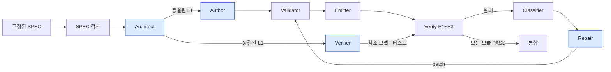

# LLM 기반 RTL 생성 파이프라인 설계

Oct 6, 2026 · @Seungjoon Lee

관련 문서: [ARCHITECTURE](../ARCHITECTURE.md) · [IMPLEMENTATION](../IMPLEMENTATION.md)

## 개요

이 파이프라인은 자연어 SPEC에서 일반 RTL(SystemVerilog)을 생성합니다. LLM이 편집하는 면은 구조화된 IR로 제한하고, 코드 방출은 툴이 결정론적으로 수행합니다.

생성된 RTL은 사람이 읽고 합성, STA, ECO 같은 후속 플로우에 넣는다고 가정합니다.

- **구조는 JSON, 동작은 SV 조각.** 계층, 인터페이스, 상태 선언은 JSON으로 두고, 동작은 타입이 붙은 슬롯 안의 SV 조각으로 둡니다. 순수 JSON IR은 일반 RTL에서 SV AST의 재발명이 되므로 채택하지 않았습니다.
- **IR이 유일한 소스.** RTL에서 IR로 되돌아가는 역파싱은 없습니다. RTL은 항상 IR에서 다시 방출합니다.
- **보장의 범위.** 툴이 보장하는 것은 구조(포트, 리셋, 드라이버, 도메인)입니다. 조각 내부의 논리는 LLM의 몫이고, 대신 오류가 조각 하나로 국소화됩니다.
- **LLM은 coding agent로만 사용.** 에이전트는 모두 coding agent(Pi, Codex 등) 세션입니다. 스케줄러가 작업마다 headless로 띄우고, 파이프라인 코드는 모델 API를 직접 부르지 않습니다.
- **생성과 검증의 격리.** RTL을 쓰는 에이전트와 테스트를 쓰는 에이전트는 서로의 산출물을 보거나 고칠 수 없습니다. 두 에이전트는 서로 다른 계열의 로컬 모델을 씁니다.
- **수렴 대상.** 루프는 "스펙 충족"이 아니라 "테스트 통과"로 수렴합니다. 그 간극은 사람 승인 게이트와 Block Top 참조 모델로 줄입니다.

## 확정된 결정 사항

아래 26개 항목은 논의를 거쳐 확정되었고, 이후 섹션은 모두 이 결정을 전제로 합니다.

| 항목 | 결정 |
| --- | --- |
| 생성 범위 | 일반 RTL 전체 |
| IR 방식 | 계층형. 구조는 JSON, 동작은 SV 조각 |
| 방출 언어 | SystemVerilog. `interface`와 `modport`는 방출하지 않고 평탄화된 포트를 사용 |
| 루프 내 lint와 sim | Verilator |
| 최종 lint | VC SpyGlass. 모듈 루프와 통합 단계 모두에서 실행하고 사내 룰셋과 실행 템플릿을 사용 |
| 관용구 노드 | 얇게. `fsm`, `cdc_sync`, `memory`만 둠 |
| 계층 규칙 | Top과 Block Top은 인스턴스, 연결, 동기화 셀만 가짐. 그 아래 계층 모듈은 로직을 포함할 수 있음 |
| 사람 개입 시점 | 실행 전 SPEC 고정과 실행 후 최종 승인. 실행 중 게이트는 멈추지 않고 검토 항목으로 기록 |
| 기능 오라클 | Verifier가 작성한 참조 모델. 사람 검토는 최종 승인에서 |
| 참조 모델 계층 | 혼합. Block Top은 필수, 하위 모듈은 경량 검증 |
| 테스트 수정 권한 | TB 실행 오류는 자동 수정. 기댓값 변경은 Arbiter 제안과 사람 승인 |
| SPEC 정본과 입력 | 정본은 사내 Word 양식과 PDF 문서. Markdown으로 변환하고 사람이 검토해 고정한 것만 파이프라인 입력으로 사용 |
| 블록 다이어그램 | Block Top의 경계와 외부 인터페이스만 정의. Visio 또는 SVG 원본 파일을 파싱 |
| 타이밍 다이어그램 | WaveJSON으로 변환하고 규범 또는 예시 태그와 작성자의 설명을 붙임 |
| 예시 시나리오 | 필수. Block Top당 정상 동작 하나와 코너 케이스 하나 이상 |
| 레지스터 맵 | 엑셀 파일이 기준. 문서 안의 표는 입력으로 쓰지 않음 |
| LLM 실행 방식 | coding agent를 headless로 실행. 파이프라인 코드는 모델 API를 직접 호출하지 않음 |
| 에이전트 자율 수준 | 도구 사용 에이전트. 제출 전에 사전 실행 도구로 스스로 확인 |
| 오케스트레이션 | 혼합. 바깥 제어 흐름은 결정론적 스케줄러, 에이전트 내부 루프는 coding agent 런타임 |
| 중복 구성 | Author와 Verifier를 기본 2개씩 둠. 사용자 요청으로 늘릴 수 있음 |
| 모델 선택 | 사용자가 직접 지정. Verifier는 Author와 다른 계열의 로컬 모델 |
| 운영 환경 | 폐쇄망 안에서 로컬 모델로만 실행. 비전 모델 포함 |
| 외부 모듈 | 직접 작성한 블록과 기존 IP를 L1만 가진 external 모듈로 허용 |
| 전력 도메인 | SPEC 2번 섹션과 L1에 추가. v1에서는 UPF 작성과 DCLint의 입력으로만 사용 |
| SDC 골격 | Emitter가 클럭 정의, 비동기 클럭 그룹, CDC 경로 제약을 방출 |
| 부서 계층 연계 | 실행 제출, 상태와 결과 조회, 환류의 세 인터페이스. 환류에 검사 실패 리포트를 추가 |

## SPEC 작성 규격과 변환

SPEC의 정본은 사내 Word 문서, PDF 문서, 엑셀 레지스터 맵이고, 파이프라인은 이를 변환한 뒤 사람이 검토해 고정한 Markdown만 입력으로 받습니다. SPEC 단위는 Block Top 하나당 문서 하나입니다.

### 변환 대상과 방법

| 원본 | 변환 방법 | 변환 결과 | 사람 검토 |
| --- | --- | --- | --- |
| Word 본문과 표 | 툴 변환 (결정론적) | 10개 섹션 템플릿에 대응된 Markdown | 섹션 대응 확인 |
| PDF 본문과 표 | 툴 추출. 표와 제목 구조는 배치에서 추정 | 10개 섹션 템플릿에 대응된 Markdown | 전부. 표의 행과 열, 제목 계층 확인 |
| 블록 다이어그램 | Visio 또는 SVG 원본 파일 파싱. PDF 안의 벡터 그림은 추출해 SVG와 같은 방식으로 처리 | Block Top 경계와 경계를 지나는 신호 목록 | 파싱 실패 항목만 |
| 타이밍 다이어그램 | 비전 모델을 쓰는 coding agent가 WaveJSON으로 변환 | 사이클 단위 텍스트 파형 | 전부. 다시 렌더링해 원본과 대조 |
| 레지스터 맵 | 엑셀 직접 파싱 | 레지스터와 필드 표 | 없음 |

- **원본 우선순위.** 같은 SPEC에 Word와 PDF가 모두 있으면 Word를 변환합니다. 구조 정보가 더 많이 남아 있기 때문입니다.
- **PDF의 한계.** PDF에는 표와 제목의 구조가 없어 추출이 추정에 의존하므로, 변환 결과 전체를 사람이 검토합니다. 텍스트 레이어가 없는 스캔 PDF는 OCR을 거칩니다.
- **재변환.** 원본이 개정될 때마다 다시 변환합니다. 다이어그램 변환 결과는 원본 해시를 키로 저장하고, 그림이 바뀐 경우에만 다시 변환하고 검토합니다.
- **레지스터 맵 우선순위.** Word와 PDF 안의 표는 일부 column이 빠진 사본이므로 입력으로 쓰지 않습니다. 엑셀과 IP-XACT가 다르면 엑셀을 따르고, 문서 안의 표가 엑셀과 다르면 경고합니다.

### 템플릿 섹션

| 섹션 | 형식 | 소비하는 곳 |
| --- | --- | --- |
| 1. 목적과 범위 | 한 문단. 범위 밖 항목 명시 | Architect |
| 2. 클럭, 리셋, 전력 | 표 (도메인, 주파수, 리셋 극성, 동기 여부, 도메인 간 관계, 전력 도메인, isolation, retention) | L1 `domains` |
| 3. 인터페이스 | 표 (포트 또는 번들, 방향, 타입, 프로토콜 태그, 도메인) | L1 `ports` |
| 4. 파라미터 | 표 (이름, 타입, 기본값, 허용 범위) | L1 `params` |
| 5. 기능 요구사항 | ID가 붙은 문장 목록 | Architect, Author, Verifier |
| 6. 타이밍과 성능 | ID가 붙은 문장 (지연 사이클 수, backpressure 동작) | Verifier의 속성 체커 |
| 7. 예외와 코너 케이스 | ID가 붙은 문장. 정의하지 않는 동작은 "미정의"로 명시 | Verifier, Arbiter |
| 8. 예시 시나리오 | 입력 트랜잭션과 기대 출력의 표, 예시 파형 | Verifier의 directed 테스트 |
| 9. 구현 제약 | 필수 구조, 금지 사항 | Architect, Author |
| 10. 열린 질문 | 목록 | 승인 게이트 |

Word 양식의 실제 목차와 이 10개 섹션의 대응은 원본 양식을 받은 뒤 확정합니다.

### 블록 다이어그램

블록 다이어그램은 Block Top의 경계와 외부 인터페이스만 정의하고, 내부 분해는 Architect가 합니다.

- **Block Top의 L1.** 2번, 3번, 4번 섹션의 표에서 툴이 직접 만듭니다. 타입, 프로토콜, 도메인은 그림에 없으므로 표가 출처입니다.
- **그림의 역할.** 어느 블록이 Block Top인지 지정하고, 경계를 지나는 신호의 이름과 방향을 인터페이스 표와 교차 검사합니다. 불일치는 SPEC 검사 오류입니다.
- **파싱 방식.** Visio는 연결선이 도형에 붙어 있으면 연결 관계를 그대로 읽습니다. SVG에는 연결 정보가 없어서 선의 끝점과 도형 경계의 좌표로 추정합니다. PDF 안의 벡터 그림은 추출해 SVG와 같은 방식으로 처리하고, 래스터 그림은 원본 파일을 요구합니다.
- **파싱 실패.** 비전 추출로 대체하지 않고, 작성자에게 그림 수정 요청으로 돌려줍니다.

그림 작성 규칙은 아래 세 가지이며, 원본 그림을 확인한 뒤 확정합니다.

- Block Top 도형에 정해진 표시를 둡니다. Visio는 도형 데이터 속성, SVG는 요소 id 규칙을 씁니다.
- 경계를 지나는 모든 연결선에 신호 또는 번들 이름을 라벨로 붙입니다.
- 연결선은 도형에 붙여 그리고, 화살표로 방향을 표시합니다.

### 타이밍 다이어그램

타이밍 다이어그램은 WaveJSON으로 변환하고, 그림마다 작성자가 태그와 설명을 붙입니다. 그림은 한 가지 경우의 파형만 보여 주므로, 어디까지가 요구인지는 작성자만 정할 수 있습니다.

| 항목 | 작성 주체 | 내용 |
| --- | --- | --- |
| WaveJSON | 비전 coding agent, 사람 확인 | 사이클 단위 파형. 다시 렌더링해 원본과 나란히 대조 |
| 태그 | 작성자 | 규범 또는 예시 |
| 설명 | 작성자 | 그림이 뜻하는 바. 어느 부분이 요구이고 어느 부분이 한 가지 예일 뿐인지 |
| 요구사항 연결 | 작성자 | 규범인 경우 6번 섹션의 요구사항 ID |

- **규범.** 그림이 뜻하는 제약을 6번 섹션의 요구사항 문장으로 쓰고 ID로 연결합니다.
- **예시.** 8번 섹션의 시나리오로 편입합니다. 사이클 단위 기댓값이 있으므로 directed 테스트 벡터로 그대로 씁니다.
- **태그와 설명의 위치.** Word 문서의 그림 아래에 정해진 형식으로 씁니다. 정본이 Word 하나로 유지되고 재변환 뒤에도 남습니다. 수정할 수 없는 PDF 원본은 그림별 주석 파일에 씁니다.

### 요구사항 문장 규칙

- 한 문장에 동작 하나만 쓰고 ID를 붙입니다.
- 외부에서 관측되는 신호와 트랜잭션으로 기술합니다. 내부 구현은 9번 섹션에만 씁니다.
- 조건, 동작, 타이밍 순서로 쓰고 수치를 명시합니다.
- 용어집의 용어만 쓰고, 의무 수준(필수, 권장, 허용)을 구분합니다.

예시 시나리오는 필수이며, Block Top당 정상 동작 하나와 코너 케이스 하나 이상을 씁니다.

### SPEC 검사 게이트

변환된 SPEC은 아래 검사를 통과한 뒤 버전을 고정해 Architect로 넘깁니다.

- **툴 검사.** 필수 섹션이 있는지, 표가 파싱되는지, 모든 출력 포트에 동작을 정의한 요구사항이 있는지, 모든 포트가 요구사항에서 한 번 이상 참조되는지, 그림의 경계 신호가 인터페이스 표와 일치하는지 봅니다.
- **LLM 검사.** 모호한 문장, 서로 모순되는 요구사항, 빠진 코너 케이스를 찾아 질문 목록으로 작성자에게 돌려줍니다.
- **미해결 질문.** 답하지 않고 넘긴 질문은 "해석이 갈린 지점"으로 기록되어 인터페이스를 최종 승인의 검토 항목으로 올립니다.
- **추적.** Verifier는 모든 요구사항 ID에 검사를 하나 이상 대응시키고, 불일치 리포트와 Arbiter의 판정은 ID를 인용합니다.

## 전체 파이프라인

파이프라인은 고정된 SPEC을 받아 Architect가 인터페이스를 동결한 뒤 모듈 루프를 돌리고, 모든 모듈이 PASS하면 Block Top과 Top에서 통합 검증하는 순서로 진행됩니다.



색이 칠해진 네 상자가 LLM 에이전트(coding agent 세션)이고 나머지는 결정론적 툴입니다. Verify가 실패하면 Classifier가 유형을 나눠 Repair로 보내고, patch 후에는 Validator부터 다시 실행합니다.

### 구성요소

| 구성요소 | 종류 | 입력 | 출력 |
| --- | --- | --- | --- |
| SPEC 변환 | 툴, 비전 coding agent | Word 또는 PDF 문서, 다이어그램 원본, 엑셀 레지스터 맵 | Markdown SPEC 초안, WaveJSON, 경계 신호 목록 |
| SPEC 검사 | 툴, LLM | Markdown SPEC 초안 | 고정된 SPEC, 또는 작성자에게 돌려줄 질문 목록 |
| Architect | LLM | 고정된 SPEC, SPEC 표에서 만든 Block Top의 L1 | 모듈 트리, 하위 모듈의 L1, `top`과 `block_top`의 연결, 가정 목록 |
| Author | LLM | SPEC 해당 부분, 동결된 L1 | 자기 모듈의 L2, L3, 내부 연결 |
| Validator | 툴 | IR | 통과, 또는 노드가 지정된 오류 |
| Emitter | 툴 | 검증된 IR | SV 파일, 소스맵, SDC 골격 |
| Verifier | LLM | 고정된 SPEC, 동결된 L1 | 참조 모델, 시나리오, 속성 체커 |
| Verify | 툴 | SV, 테스트 | E1\~E3 결과 |
| Classifier | 툴 | 실패 결과, 소스맵 | 실패 유형, 대상 노드 또는 트레이스 |
| Repair | LLM | SPEC, IR, 실패 리포트, patch 이력 | patch 목록 |
| Arbiter | LLM | SPEC, 불일치 트레이스, 양쪽 기댓값 | 테스트 수정안. 사람 승인 필요 |
| 통합 | 툴 | 전체 SV, L0 | Block Top과 Top의 E1\~E3 결과 |

Arbiter는 그림의 에스컬레이션 경로에 속하며, RTL과 참조 모델 중 어느 쪽이 틀렸는지 판정합니다.

### 실행 순서

- **모듈 루프.** 트리 아래에서 위로 진행하고 같은 레벨은 병렬로 실행합니다. 부모는 PASS한 실제 자식을 포함해 검증하고, 부모의 Repair는 부모 자신만 고칩니다.
- **파일 단위.** 모듈당 파일이 하나라서 루프와 diff가 모듈 단위로 분리됩니다.
- **동결 해제.** 모듈 루프가 인터페이스 자체의 오류를 발견하면 Architect로 올리고, 영향받는 모듈만 다시 실행합니다.

## 멀티에이전트 구성

파이프라인은 결정론적 스케줄러가 제어 흐름을 맡고, 다섯 종류의 LLM 에이전트가 격리된 작업 디렉터리에서 도구를 쓰며 일하는 구조로 실행합니다. 에이전트는 모두 스케줄러가 headless로 띄우는 coding agent 세션이며, OpenRig의 Seat가 아닙니다. Author와 Verifier는 기본 2개씩 두고, 서로 다른 계열의 로컬 모델을 씁니다.

### 원칙

- **제어 흐름은 결정론적.** 순서, 분기, 반복 상한, 게이트는 스케줄러가 정합니다. 다음 단계를 LLM이 고르지 않습니다.
- **통신은 산출물로만.** 에이전트끼리 직접 메시지를 주고받지 않습니다. IR 파일, 실패 리포트, ID가 붙은 SPEC만 오갑니다.
- **쓰기 범위는 툴이 강제.** 범위를 벗어난 patch는 프롬프트가 아니라 patch 적용 툴이 거부합니다.
- **툴은 에이전트로 만들지 않음.** Validator, Emitter, Classifier, Verify는 그대로 결정론적 툴입니다.

### 에이전트별 경계

| 에이전트 | 인스턴스 | 볼 수 있는 것 | 쓸 수 있는 것 | 도구 |
| --- | --- | --- | --- | --- |
| Architect | 설계당 1 | 고정된 SPEC, Block Top의 L1 | 모듈 트리, 하위 L1, 가정 목록 | 구조 Validator 사전 실행 |
| Author | 모듈당 2 (기본) | SPEC 해당 부분, 동결된 L1 | 자기 후보의 L2, L3 | Validator 사전 실행 |
| Verifier | Block Top당 2 (기본), 하위 모듈당 1 | 고정된 SPEC, 동결된 L1 | 참조 모델, 테스트 | 하니스 생성, 모델 단독 실행 |
| Repair | 후보당 1 | SPEC, 자기 후보의 IR, 실패 리포트, patch 이력 | patch | patch 사전 실행, 팬인 조회, 트레이스 조회 |
| Arbiter | 불일치당 1 | SPEC, 불일치 트레이스, 양쪽 기댓값 | 수정 제안 | SPEC 구절 조회 |

Author끼리, Verifier끼리는 서로의 산출물을 보지 못합니다.

### 오케스트레이션

- **바깥 제어 흐름.** 워크플로 엔진 또는 자체 스케줄러가 맡습니다. 모듈 의존 그래프, 게이트, 자원 대기열, 상태 저장을 가집니다.
- **에이전트 실행.** 스케줄러는 작업마다 coding agent 프로세스를 headless로 띄웁니다. 실행 전에 격리된 작업 디렉터리를 만들고 과제 파일(`TASK.md`), 입력 산출물, 도구를 둡니다. 종료 후에는 정해진 경로의 출력 산출물을 회수하고 세션은 버립니다.
- **에이전트 내부 루프.** 파일 읽기와 쓰기, 도구 실행, 재시도 같은 작업 안의 반복은 coding agent 런타임이 맡습니다. 런타임은 폐쇄망의 로컬 모델과 호환이 확인된 것을 쓰고, 모델 계열마다 다를 수 있습니다. 파이프라인 코드는 모델 API를 직접 부르지 않습니다.
- **런타임 어댑터.** 런타임마다 다른 것은 headless 실행 명령뿐이고, 어댑터가 이 차이를 흡수합니다. 스케줄러는 모든 에이전트를 같은 작업 인터페이스로 다룹니다. 입력 산출물, 도구 집합, 쓰기 범위를 주고 출력 산출물을 받습니다.
- **공통 도구.** 도구는 작업 디렉터리에서 실행하는 CLI로 만들고, 필요하면 MCP 서버로도 노출합니다. 런타임이 달라도 같은 도구를 씁니다.
- **종료 게이트.** 스케줄러는 Validator를 통과한 산출물만 받습니다. 작업 디렉터리를 실행 전후로 비교해 쓰기 범위 밖의 변경이 있으면 산출물을 거부합니다. 런타임별 훅에 의존하지 않습니다.
- **OpenRig를 쓰지 않는 이유.** 파이프라인 에이전트는 OpenRig Seat로 띄우지 않습니다. 이유는 세 가지입니다.
  - OpenRig의 `rig send`는 edge와 관계없이 어느 세션에나 메시지를 넣을 수 있어, 메시지 격리를 지킬 수 없습니다.
  - 대화형 세션은 스스로 종료하지 않아 완료 신호를 따로 만들어야 합니다.
  - 작업마다 새 컨텍스트로 시작하는 단기 세션 수십 개는 장기 Seat용 데몬과 맞지 않습니다.
- **관측.** 실시간으로 볼 수 없는 대신, 스케줄러가 에이전트의 출력과 transcript, 작업 디렉터리를 실행 ID별로 보관합니다. 실행 상세 화면에서 이를 열람하고, 같은 작업 디렉터리로 재현할 수 있습니다.

### 중복 구성

| 역할 | 기본 개수 | 적용 범위 | 모델 |
| --- | --- | --- | --- |
| Author | 2 | 모든 로직 모듈 | 사용자가 지정 |
| Verifier | 2 | Block Top. 하위 모듈은 1 | 사용자가 지정. Author와 다른 계열의 로컬 모델 |

- **개수.** 사용자 요청에 따라 늘릴 수 있습니다.
- **모델 선택.** 역할별 모델은 사용자가 설정으로 정합니다. Verifier와 Author의 모델 계열이 겹치면 스케줄러가 실행 전에 경고합니다.

### 차분 검사

| 검사 | 시점 | 방법 | 불일치의 의미 | 처리 |
| --- | --- | --- | --- | --- |
| Verifier 간 차분 | RTL 생성 전 | 참조 모델들에 같은 무작위 입력을 넣어 비교 | SPEC의 모호함, 또는 한쪽 모델의 오류 | Arbiter 판정 |
| Author 후보 간 차분 | 후보들이 테스트를 통과한 뒤 | 통과한 후보들에 같은 무작위 입력을 넣어 비교 | 테스트의 구멍 | Verifier에게 돌려 테스트 보강 |

### 후보 선택

- **통과 기준.** 후보는 모든 Verifier의 테스트를 통과해야 합니다. 한 Verifier의 테스트만 실패하면 그 Verifier의 오류일 수 있으므로 Arbiter가 판정합니다.
- **선택.** 통과한 후보 중 Repair 횟수가 적고 lint 경고가 적은 것을 고릅니다.
- **탈락.** 반복 상한에 걸린 후보는 버립니다. 모든 후보가 탈락하면 그 모듈을 멈추고 검토 항목으로 기록합니다.
- **Repair.** 후보마다 Repair 루프를 따로 돌립니다.
- **VC SpyGlass.** E1과 E2는 모든 후보에 실행하고, E3은 선택된 후보에만 실행합니다.

### 실행 중 운영

- **동결 해제의 전파.** 인터페이스가 바뀌면 영향받는 모듈의 진행 중인 루프를 취소하고 다시 시작합니다.
- **자원 대기열.** VC SpyGlass 실행은 라이선스 수에 맞춘 대기열을 거칩니다.
- **비용 상한.** 후보별 반복 상한과 설계 전체의 예산 상한을 둡니다.
- **상태 저장.** 승인 대기와 장애에 대비해 모듈별 상태를 저장하고 재개합니다.

## 부서 계층과의 연계

파이프라인은 Chip Design Department의 실행 계층으로 동작하고, 부서 계층과는 세 가지 인터페이스로만 만납니다. Seat 구성과 진행 순서는 [Chip Design Department 설계](./Chip%20Design%20Department%20설계.md)에 있습니다.

| 인터페이스 | 내용 |
| --- | --- |
| 실행 제출 | 고정된 SPEC 버전과 설정(모델, 후보 개수, 예산)을 받고 실행 ID를 돌려줌 |
| 상태와 결과 조회 | 모듈별 상태, 검토 항목, 최종 보고서, 승인된 RTL을 제공 |
| 환류 | 검사 실패 리포트, SPEC 변경 요청, 생성기 버그 리포트, 설정 변경을 받음 |

### 검사 실패 리포트

파이프라인 밖의 툴이 낸 위반을 Classifier가 받아 내부 lint 실패와 같은 경로로 처리합니다. 대상은 Superlint, Xprop, DFT, DCLint, 합성, LEC의 리포트입니다.

- **입력.** 툴 이름, 규칙, 파일, 줄 번호, 메시지입니다.
- **분류.** 소스맵으로 노드에 대응시킵니다. 조각 내부이면 Repair로, 골격 코드이면 생성기 버그로 보냅니다.
- **재검증.** patch 뒤에는 Validator부터 E3까지 다시 통과시키고, 해당 외부 검사의 재실행을 부서 계층에 요청합니다.

### 외부 모듈

직접 작성한 블록과 기존 IP는 `external` role의 모듈로 등록하고, IR에는 L1만 둡니다.

- **방출.** Emitter는 외부 모듈을 방출하지 않고, 등록된 RTL 파일을 그대로 참조합니다.
- **검증.** 파이프라인은 외부 모듈 자체를 검증하지 않습니다. 부모 모듈을 검증할 때는 실제 RTL을 포함해 시뮬레이션합니다.
- **조합 경로.** L1에 입력에서 출력으로 가는 조합 경로를 선언합니다. 선언이 없으면 모든 입력에서 모든 출력으로 경로가 있다고 가정하고 V6을 적용합니다.
- **도메인.** 포트의 클럭 도메인 선언에 V8과 V10을 그대로 적용합니다.

### SDC 골격

Emitter는 Block Top마다 L1에서 유도할 수 있는 제약만 SDC로 방출하고, 나머지는 사람이 씁니다.

| 방출 항목 | 출처 |
| --- | --- |
| 클럭 정의 | L1 `domains`의 클럭과 주파수 |
| 비동기 클럭 그룹 | SPEC 2번 섹션의 도메인 간 관계 |
| CDC 경로 제약 | `cdc_sync` 노드 |

입출력 지연과 예외 경로는 방출하지 않습니다. 방출된 골격은 DCLint의 입력이 되고, SDC Lint에서 사람이 쓴 제약과 대조됩니다.

### 전력 도메인

SPEC 2번 섹션의 전력 도메인, isolation, retention 정보를 L1에 그대로 기록합니다. v1에서는 UPF 작성과 DCLint의 입력으로만 쓰고, 전력 도메인 사이의 신호에 대한 Validator 규칙은 두지 않습니다.

## IR 스키마

IR은 모듈당 JSON 파일 하나로 구성되고, 각 파일은 계층 연결(L0), 인터페이스(L1), 상태 선언(L2), 동작(L3)을 담습니다.

### 공통 원칙

- 이름이 있는 것(파라미터, 포트, 신호, 타입, 인스턴스)은 이름이 키입니다. 별도 `id`는 이름이 없는 블록, 전이, 연결에만 둡니다.
- 타입, 리셋값, 조건식, 파라미터 값은 SV 문자열입니다. pyslang이 모듈 문맥에서 파싱해 검증합니다.
- 클럭과 리셋 포트는 `domains`에서 유도됩니다. LLM은 sensitivity list와 리셋 분기를 쓰지 않습니다.
- patch, 소스맵, 에러 리포트는 배열 인덱스가 아니라 이름과 `id`로 노드를 가리킵니다.

### 모듈 role

| role | 가질 수 있는 것 | 금지 |
| --- | --- | --- |
| `top` | 포트, 인스턴스, 연결, 동기화 셀(cdc\_sync) | 동기화 셀 외의 블록, 동기화 셀에 쓰이지 않는 내부 신호 |
| `block_top` | 포트, 인스턴스, 연결, 동기화 셀(cdc\_sync) | 동기화 셀 외의 블록, 동기화 셀에 쓰이지 않는 내부 신호 |
| `module` | 포트, 신호, 블록, 인스턴스, 연결 | 없음 |
| `external` | 포트. L1만 가짐 | 신호, 블록, 인스턴스, 연결 |

`module`의 연결은 끝점으로 내부 신호를 쓸 수 있습니다. 인스턴스 출력은 그 신호의 writer로 계산됩니다.

### 계층별 내용

| 계층 | 필드 | 내용 |
| --- | --- | --- |
| L0 | `instances`, `connections` | 인스턴스(파라미터 바인딩, `domain_map`)와 연결. 번들은 프로토콜이 같고 역할이 반대이면 한 줄로 연결 |
| L1 | `params`, `domains`, `ports` | 파라미터, 클럭 도메인(클럭, 주파수, 에지, 리셋 극성과 동기 여부), 전력 도메인, 포트. 포트는 단독이거나 프로토콜 태그가 붙은 번들 |
| L2 | `types`, `signals` | enum과 struct 타입, 내부 신호. 신호는 `reg`(도메인, 리셋값) 또는 `wire` |
| L3 | `blocks` | 동작 블록 다섯 종류 |

포트의 `domain`이 `null`이면 비동기 입력이고, `cdc_sync`의 `src`로만 읽을 수 있습니다. Top과 Block Top에는 `cdc_sync`도 둘 수 있습니다. 도메인이 다른 블록 간 연결은 그 계층의 동기화 셀을 거치거나 수신 모듈의 비동기 포트로 받습니다.

### 블록 종류

| kind | 작성 내용 | 방출 |
| --- | --- | --- |
| `comb` | `reads`, `writes`, `body` | `always_comb` |
| `seq` | `domain`, `reads`, `writes`, `body` | Emitter가 `always_ff`와 리셋 분기를 씌움. 리셋값은 신호 선언에서 가져옴 |
| `fsm` | 상태 타입, 리셋 상태, 전이 목록 | 상태 레지스터와 next-state 로직. `state_q`를 노출 |
| `cdc_sync` | `src`, `src_domain`, `dst`, `dst_domain`, `style` | 프로젝트 표준 동기화 셀 인스턴스. v1의 `style`은 단일 비트 `2ff` |
| `memory` | `name`, `word_type`, `depth`, `impl`, `ports` | 추론형 배열 또는 공정별 매크로 래퍼 인스턴스 |

`fsm`에서 같은 상태의 조건이 겹치면 배열 순서가 우선순위이고, 일치하는 전이가 없으면 현재 상태를 유지합니다. FSM 출력은 일반 `comb`와 `seq` 블록이 `state_q`를 읽어 만듭니다.

### 예시: 로직 모듈

```json
{
  "module": "pkt_parser",
  "role": "module",

  "params":  [{ "name": "SYNC_BYTE", "type": "logic [7:0]", "default": "8'hA5" }],
  "domains": [{ "name": "sys", "clock": "clk", "edge": "pos",
                "reset": { "port": "rst_n", "active": "low", "async": true } }],
  "ports": [
    { "bundle": "s", "protocol": "valid_ready", "role": "sink", "domain": "sys",
      "signals": [
        { "name": "s_valid", "dir": "input",  "type": "logic" },
        { "name": "s_ready", "dir": "output", "type": "logic", "kind": "wire" },
        { "name": "s_data",  "dir": "input",  "type": "logic [7:0]" }
      ] },
    { "name": "pkt_valid", "dir": "output", "type": "logic",
      "domain": "sys", "kind": "reg", "reset": "1'b0" }
  ],

  "types":   [{ "name": "state_e", "kind": "enum",
                "members": ["IDLE", "HEADER", "PAYLOAD"] }],
  "signals": [
    { "name": "byte_cnt", "kind": "reg",  "type": "logic [7:0]", "domain": "sys", "reset": "'0" },
    { "name": "sync_hit", "kind": "wire", "type": "logic" }
  ],

  "blocks": [
    { "id": "k_hit", "kind": "comb",
      "reads": ["s_valid", "s_data"], "writes": ["sync_hit", "s_ready"],
      "body": "s_ready = 1'b1; sync_hit = s_valid && (s_data == SYNC_BYTE);" },

    { "id": "k_fsm", "kind": "fsm", "domain": "sys",
      "state_type": "state_e", "state_name": "state", "reset_state": "IDLE",
      "reads": ["sync_hit", "s_valid", "byte_cnt"],
      "transitions": [
        { "id": "tr1", "from": "IDLE",    "to": "HEADER",  "cond": "sync_hit" },
        { "id": "tr2", "from": "HEADER",  "to": "PAYLOAD", "cond": "s_valid" },
        { "id": "tr3", "from": "PAYLOAD", "to": "IDLE",    "cond": "s_valid && byte_cnt == 8'd1" }
      ] },

    { "id": "k_cnt", "kind": "seq", "domain": "sys",
      "reads": ["state_q", "s_valid", "s_data", "byte_cnt"],
      "writes": ["byte_cnt", "pkt_valid"],
      "body": "pkt_valid <= 1'b0; if (state_q == HEADER && s_valid) byte_cnt <= s_data; else if (state_q == PAYLOAD && s_valid) begin byte_cnt <= byte_cnt - 8'd1; pkt_valid <= (byte_cnt == 8'd1); end" }
  ]
}
```

블록 `k_cnt`는 다음과 같이 방출됩니다. `always_ff` 선언과 리셋 분기는 Emitter가 만들고, `else` 안쪽만 LLM이 쓴 조각입니다.

```systemverilog
// @ir k_cnt
always_ff @(posedge clk or negedge rst_n) begin
  if (!rst_n) begin
    byte_cnt  <= '0;
    pkt_valid <= 1'b0;
  end else begin
    pkt_valid <= 1'b0;
    if (state_q == HEADER && s_valid) byte_cnt <= s_data;
    else if (state_q == PAYLOAD && s_valid) begin
      byte_cnt  <= byte_cnt - 8'd1;
      pkt_valid <= (byte_cnt == 8'd1);
    end
  end
end
```

### 예시: Block Top

```json
{
  "module": "pkt_rx_top",
  "role": "block_top",
  "params": [], "domains": [ ... ], "ports": [ ... ],
  "instances": [
    { "name": "u_parser", "module": "pkt_parser",
      "params": { "SYNC_BYTE": "8'hA5" },
      "domain_map": { "sys": "sys" } }
  ],
  "connections": [
    { "id": "c1", "from": "self.s",             "to": "u_parser.s" },
    { "id": "c2", "from": "u_parser.pkt_valid", "to": "u_fifo.wr_en" }
  ]
}
```

클럭과 리셋은 `domain_map`으로만 연결하고 수동 배선은 없습니다.

## Validator 규칙

Validator는 방출 전에 IR을 11단계로 검사하고, 모든 오류에 노드 이름이나 `id`를 붙여 돌려줍니다.

| 단계 | 검사 내용 | 수단 |
| --- | --- | --- |
| V1 스키마 | 형식, 이름 중복, SV 식별자 적법성, 예약어 | JSON Schema, 테이블 |
| V2 참조 | 도메인, 타입, 신호, 모듈, 파라미터 참조가 모두 존재 | 심볼 테이블 |
| V3 표현식 | 타입, 리셋값, 조건식, 파라미터 값이 파싱되고 폭이 맞음 | pyslang |
| V4 조각 | `body`가 파싱됨. 실제 읽기 ⊆ `reads`, 실제 쓰기 = `writes`. `seq`에는 non-blocking만, `comb`에는 blocking만. 지연, `initial`, `force` 금지 | pyslang AST |
| V5 드라이버 | wire와 출력의 writer는 블록 또는 인스턴스 출력 중 정확히 하나. reg는 같은 도메인의 `seq` 블록 하나만. 입력에는 쓰기 금지 | reads/writes 그래프 |
| V6 래치와 루프 | `comb` 블록의 각 `writes` 신호는 본문 최상위에 무조건 대입이 먼저 있어야 함. 조합 의존 그래프에 순환이 없어야 함. 인스턴스 관통 경로는 자식의 입력→출력 조합 경로 요약으로 계산 | AST, 그래프 |
| V7 리셋 | 한 `seq` 블록의 `writes`는 리셋 유무가 모두 같아야 함 | 선언 대조 |
| V8 도메인 | `seq` 블록은 같은 도메인의 신호나 `cdc_sync`의 `dst`만 읽음. wire는 팬인으로 도메인을 유도하고 두 도메인이 섞이면 오류. 비동기 포트는 `cdc_sync`의 `src`로만 사용 | 그래프 전파 |
| V9 FSM | 상태가 enum 멤버임. 리셋 상태에서 모든 상태에 도달 가능. 나가는 전이가 없는 상태는 경고 | 그래프 |
| V10 계층 | `top`과 `block_top`에 동기화 셀 외의 블록이 없음. 인스턴스 입력은 정확히 한 번 연결. 번들의 프로토콜과 역할이 호환. 파라미터 대입 후 타입 일치. 연결 양단의 클럭이 다르면 동기화 셀을 거치거나 수신 측이 비동기 포트여야 함 | 계층 해석 |
| V11 동결 | 동결 이후 Author와 Repair의 patch가 동결 범위를 바꾸지 않음 | 해시 비교 |

동결 범위는 모든 모듈의 L1, 모든 모듈의 인스턴스 목록, `top`과 `block_top`의 연결과 동기화 셀입니다.

VC SpyGlass에서 반복해서 걸리는 규칙은 Validator 규칙으로 옮겨 루프 초반에 잡습니다.

## 실패 분류와 Repair

Classifier는 실패를 11가지 유형으로 나누고, LLM이 고칠 수 있는 것만 Repair로 보냅니다.

| 실패 유형 | 판별 방법 | 처리 |
| --- | --- | --- |
| 스키마 위반 | JSON Schema | 같은 에이전트 재시도 |
| IR 의미 오류 | Validator | Repair. 대상 노드가 확정됨 |
| lint 에러, 조각 내부 | 소스맵이 조각 노드를 가리킴 | Repair. 해당 `body`만 수정 |
| lint 에러, 골격 | 소스맵이 조각 밖을 가리킴 | 생성기 버그이므로 사람에게 |
| sim 불일치 | 스코어보드, 속성, 프로토콜 체커 | 트레이스와 함께 Repair. N회 실패 시 Arbiter로 |
| TB 실행 오류 | Python 예외, 하니스 오류 | Verifier가 자동 수정 |
| 기댓값 오류 의심 | Arbiter 판정 | Arbiter가 SPEC 근거와 함께 수정안을 제안하고 사람이 승인 |
| 자식 모듈 원인 의심 | 부모 루프가 N회 실패하고 원인이 자식 포트 동작으로 좁혀짐 | 사람에게. 자식의 테스트가 부족하다는 뜻 |
| 인터페이스 변경 필요 | Repair가 L1 수정을 요청 | Architect로 올려 동결 해제 후 영향 모듈 재실행 |
| Verifier 간 불일치 | 참조 모델들의 차분 검사 | Arbiter 판정. SPEC의 모호함이면 검토 항목으로 기록 |
| 후보 간 불일치 | 테스트를 통과한 Author 후보들의 차분 검사 | Verifier에게 돌려 테스트 보강 |

### Repair 규칙

- **입력.** SPEC 해당 부분, 현재 IR, 실패 리포트, 이전 patch 이력을 받습니다.
- **출력.** `{op, target, field, value}` 형태의 patch 목록입니다. 툴이 적용하며, IR 전체를 다시 쓰지 않습니다.
- **범위.** 자기 모듈의 L2, L3, 연결만 고칩니다. 동결 범위와 테스트는 고칠 수 없습니다.
- **waiver.** lint waiver를 추가할 수 없습니다. 고치거나 사람에게 넘깁니다.

### 루프 제어

- **반복 상한.** 모듈당 Repair 횟수에 상한을 둡니다. 상한 값은 이식 시험 뒤에 정합니다.
- **진동 감지.** IR 해시 이력을 보관하고, 같은 해시가 다시 나오면 사람에게 넘깁니다.
- **재진입 지점.** patch 후에는 항상 Validator부터 다시 실행합니다.

## 검증 단계

검증은 모듈마다 E1 Verilator lint, E2 Verilator sim, E3 VC SpyGlass lint 순서로 실행하고, E3은 E1과 E2를 통과한 뒤에만 실행합니다.

### 실행 단위

- **모듈 루프.** 각 `module`을 트리 아래에서 위로 검증합니다. 같은 레벨은 병렬로 돌리고, 부모는 PASS한 실제 자식을 포함해 검증합니다.
- **통합 단계.** `block_top`과 `top`에 대해 E1\~E3을 다시 실행합니다.
- **VC SpyGlass.** 사내 룰셋과 실행 템플릿을 그대로 쓰고, 파일 리스트와 top 이름을 받는 래퍼로 호출합니다.
- **템플릿 사전 검증.** Emitter의 대표 출력물을 VC SpyGlass에 통과시키는 것을 Emitter의 회귀 테스트로 둡니다. 골격 코드의 위반은 LLM이 고칠 수 없기 때문입니다.

### 테스트벤치 구성

테스트벤치도 RTL과 같은 원칙으로 나눕니다. 구조는 툴이 L1에서 만들고, 동작은 LLM이 슬롯 안에 씁니다.

| 구성 | 생성 주체 | 내용 |
| --- | --- | --- |
| 하니스 | 툴 (L1에서 유도) | cocotb 클럭과 리셋 구동, 번들 프로토콜별 드라이버와 모니터, 스코어보드 골격 |
| 프로토콜 체커 | 사람이 검증한 라이브러리 | 프로토콜 태그로 자동 결합 |
| 참조 모델, 시나리오, 속성 | Verifier (LLM) | SPEC에서 작성한 Python 트랜잭션 수준 모델, directed 시퀀스, 속성 체커. SPEC의 예시 시나리오와 예시 파형은 directed 테스트로 그대로 사용 |

Verifier는 SPEC과 동결된 L1만 보고, L2, L3, RTL은 보지 못합니다. 이 격리가 없으면 루프가 테스트를 약화시키는 방향으로 수렴할 수 있습니다.

### 검사 항목

| 항목 | 내용 | 성격 |
| --- | --- | --- |
| T1 초기화 | 초기값 무작위화 시드를 여러 개로 돌려 결과가 달라지는지 확인. Verilator는 2-state라 X 검출 대신 이 방법을 씀 | 정합성 |
| T2 프로토콜 | 태그 기반 체커. 예: valid\_ready에서 ready 전까지 valid와 data 유지 | 정합성 |
| T3 기능 | 출력 번들의 트랜잭션을 참조 모델과 순서대로 비교 | 정합성 |
| T4 속성 | SPEC에서 뽑은 개별 속성 검사 | 정합성 |
| T5 커버리지 | 요구사항 ID, IR의 FSM 전이, Verilator의 line과 toggle 커버리지. 미달 항목은 Verifier에게 돌려 자극을 보강 | 테스트 충분성 |

### 계층별 오라클

| 계층 | 판정 기준 | 검증 수준 |
| --- | --- | --- |
| Block Top | 원본 SPEC | 참조 모델 필수 (T1\~T5) |
| 하위 모듈 | Architect가 분해한 파생 스펙 | 프로토콜 체커, 속성, directed 테스트 (T1, T2, T4, T5) |

원본 SPEC에 대해 직접 판정할 수 있는 곳은 Block Top 이상뿐입니다. 하위 모듈 검증은 오류 위치를 좁히는 용도입니다.

### 불일치 리포트

시뮬레이션 불일치는 다음 네 가지를 묶어 Repair에 전달합니다.

- 첫 불일치 트랜잭션
- 그 시점 전후의 FSM 상태 트레이스
- 불일치 출력의 팬인에 속한 신호 값. reads/writes 그래프로 선택
- 해당 SPEC 구절

### 테스트 수정 권한

| 대상 | 수정 주체 | 승인 |
| --- | --- | --- |
| TB 실행 오류 (Python 예외, 하니스 문제) | Verifier | 자동 |
| 기댓값이 바뀌는 수정 | Arbiter가 SPEC 근거와 함께 제안 | 사람 |
| 테스트와 모델 전체 | Repair는 수정 불가 | 해당 없음 |

### 알려진 한계

- **공통 오독.** 참조 모델도 같은 SPEC을 LLM이 읽어 만든 것입니다. 표현과 문맥이 달라 줄어들 뿐 없어지지 않습니다. Python 모델은 RTL보다 검토하기 쉬워서 사람 검토의 효율이 가장 높은 지점입니다.
- **타이밍.** 트랜잭션 수준 모델은 타이밍을 모릅니다. 번들이 아닌 단독 출력은 SPEC에 지연이 명시되어 있거나 속성 체커로 다뤄야 합니다. SPEC의 예시 파형이 사이클 단위 기댓값을 주므로 이 부분을 보완합니다.

## 사람 승인 게이트

사람은 실행 전과 실행 후에만 개입합니다. 실행 중의 게이트는 멈추지 않고 검토 항목으로 기록하며, 사람이 최종 승인에서 한 번에 검토합니다.

| 시점 | 게이트 | 검토 대상 | 동작 |
| --- | --- | --- | --- |
| 실행 전 | SPEC 고정 | 변환된 Markdown의 섹션 대응, PDF에서 추출한 표와 제목 구조, WaveJSON과 원본 파형의 대조, 검사 질문에 대한 답 | 항상 사람 검토. 통과해야 실행을 시작 |
| 실행 중 | 인터페이스 동결 | 모듈 트리, 포트와 프로토콜 표, 가정 목록 | 멈추지 않음. 아래 조건에 어긋나면 검토 항목으로 기록 |
| 실행 중 | 참조 모델 | Block Top의 참조 모델, Verifier 간 차분 결과 | 멈추지 않음. 아래 조건에 어긋나면 검토 항목으로 기록 |
| 실행 중 | 동결 해제 | 변경되는 L1과 영향 모듈 | 첫 번째는 기록하고 진행. 같은 설계에서 두 번째가 필요해지면 실행을 중단 |
| 실행 중 | 기댓값 변경 | Arbiter의 수정안과 SPEC 근거 | 해당 모듈만 승인 대기로 멈춤. 나머지 모듈은 계속 진행 |
| 실행 후 | 최종 승인 | 검증 결과, 검토 항목 전체, 선택된 후보, 차분 검사 결과 | 항상 사람 승인 |

### 검토 항목으로 기록하는 조건

아래 다섯 조건 중 하나라도 어긋나면 인터페이스와 참조 모델을 검토 항목으로 기록합니다.

- SPEC 검사의 미해결 질문과 Architect가 보고한 "스펙 해석이 갈린 지점" 목록이 모두 비어 있음
- 로직 모듈 3개 이하
- 클럭 도메인 1개
- `memory`의 `macro` 구현 없음
- 모든 번들이 표준 프로토콜 태그를 가짐

Architect는 L0와 L1과 함께 가정 목록을 반드시 출력합니다.

### 실행 중 멈추는 경우

- **기댓값 변경.** 승인 없이 적용하면 테스트가 약해진 채로 검증이 끝날 수 있으므로, 이 경우만 예외로 멈춥니다.
- **사람에게 넘기는 실패.** 생성기 버그, 자식 모듈 원인 의심, 진동, 모든 후보 탈락은 해당 모듈을 멈추고 검토 항목으로 기록합니다. 다른 모듈은 계속 진행합니다.

### 최종 승인에서의 반려

사람이 인터페이스를 반려하면 그 아래 모듈의 작업을 다시 실행합니다. 실행 중에 멈추지 않는 대신 치르는 비용입니다.

## v1 제외 항목과 구현 시 필요한 입력

v1 스키마는 아래 여섯 가지를 표현하지 못하며, 이식 시험에서 필요한 형태를 확인한 뒤 추가합니다.

- generate (인스턴스 반복, 조건부 생성)
- function과 task
- inout과 tristate
- 의도적 래치
- 다중 비트 CDC (async FIFO, 핸드셰이크)
- SVA

구현을 시작하려면 아래 입력이 필요합니다.

| 입력 | 쓰이는 곳 |
| --- | --- |
| VC SpyGlass 사내 템플릿의 호출 방식과 리포트 형식 | E3 래퍼와 리포트 파서 |
| 프로젝트 표준 동기화 셀의 이름과 포트 | `cdc_sync` 방출 |
| 메모리 매크로 래퍼 규약 | `memory`의 `macro` 방출 |
| 표준 프로토콜 태그 목록 | 번들 드라이버, 모니터, 체커 라이브러리 |
| 사내 코딩 가이드 (명명 규칙, 금지 구문) | Emitter 템플릿과 V4 금지 목록 |
| Word SPEC 양식 원본과 PDF SPEC 예시 | 템플릿 섹션 대응 확정, 변환기 |
| 엑셀 레지스터 맵 원본 | 레지스터 맵 파서의 column 정의 |
| 블록 다이어그램 원본 예시 (Visio 또는 SVG) | 다이어그램 파서, Block Top 표시 규칙 확정 |
| 역할별 coding agent 런타임과 모델 설정 (계열 포함) | 런타임 어댑터, 계열 중복 검사 |
| 로컬 모델 목록 (언어 모델, 비전 모델)과 계열 | 역할별 모델 배정, 계열 중복 검사 |
| 외부 모듈의 RTL 파일 위치와 인터페이스 정보 | `external` 모듈의 L1 작성, 부모 모듈 검증 |

## 블록 이식 시험 계획

LLM을 붙이기 전에, 이미 검증된 기존 블록 3개를 손으로 IR에 옮겨 스키마의 표현력과 Emitter의 정확성을 확인합니다.

기존 블록에는 신뢰할 수 있는 테스트벤치가 이미 있으므로, 방출된 RTL이 그 테스트벤치를 통과하는지가 LLM 없이 얻을 수 있는 가장 독립적인 판정입니다.

### 대상 블록

| 유형 | 확인하려는 것 |
| --- | --- |
| 제어 중심 (FSM 위주) | `fsm` 노드와 전이 우선순위 규칙이 실제 FSM을 담는지 |
| datapath 중심 (연산, 파이프라인) | 원시 `comb`와 `seq` 블록의 비중, 파라미터화된 폭 처리 |
| 다중 클럭 (CDC 포함) | 도메인 규칙 V8과 `cdc_sync`, 비동기 포트 모델이 충분한지 |

세 블록 중 하나는 하위 인스턴스를 가진 계층 모듈이어야 L0와 V10을 함께 확인할 수 있습니다.

### 절차

1. 대상 블록 3개의 기존 Word 또는 PDF SPEC과 엑셀 레지스터 맵을 변환하고 SPEC 검사 게이트를 통과시킵니다.
2. L0\~L3의 형식 정의를 JSON Schema로 작성합니다.
3. 최소 Emitter와 Validator V1\~V5를 구현합니다.
4. 블록 3개를 손으로 IR에 옮기고, 막힌 지점을 기록합니다.
5. 방출된 RTL을 원본 블록의 기존 테스트벤치로 검증합니다.
6. 방출된 RTL을 VC SpyGlass 사내 템플릿으로 검사합니다.
7. 기록을 바탕으로 SPEC 규격, 스키마, Validator 규칙을 수정합니다.

1번에서 고정한 SPEC 3개는 이후 LLM을 붙였을 때 정답이 있는 첫 입력이 됩니다.

### 기록 항목

| 항목 | 의미 |
| --- | --- |
| 표현 불가 구문 | 스키마에 추가해야 할 것. v1 제외 항목 중 실제로 필요한 것이 드러남 |
| 우회 표현 | 원본과 다른 구조로 바꿔야만 옮길 수 있었던 부분 |
| 원시 블록 비중 | 전체 RTL 줄 수 대비 `comb`와 `seq`의 `body` 줄 수 |
| Validator 오탐 | 정상 코드인데 규칙에 걸린 경우. 규칙이 지나치게 엄격하다는 신호 |
| 골격 코드의 SpyGlass 위반 | Emitter 템플릿에서 고쳐야 할 것 |
| SPEC 변환 실패와 검사 질문 | 양식, 그림 작성 규칙, 요구사항 문장 규칙에서 고쳐야 할 것 |

### 판정

- **원시 블록 비중이 대부분인 경우.** JSON 계층을 더 얇게 하고, SV를 유일한 소스로 두는 방식에 가깝게 조정합니다.
- **우회 표현이 많은 경우.** 생성 RTL이 사내 관행과 달라진다는 뜻이므로 블록 종류나 스키마를 확장합니다.
- **Validator 오탐이 많은 경우.** 해당 규칙을 오류에서 경고로 내리거나 조건을 좁힙니다.

### 열린 질문

- [ ] 대상 블록 3개를 무엇으로 할지
- [ ] 원시 블록 비중의 기준선을 몇 퍼센트로 둘지
